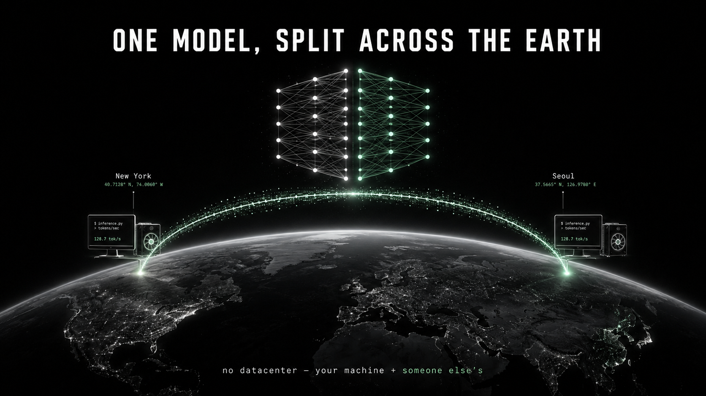
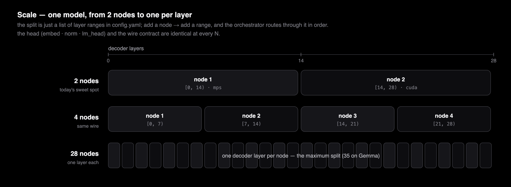
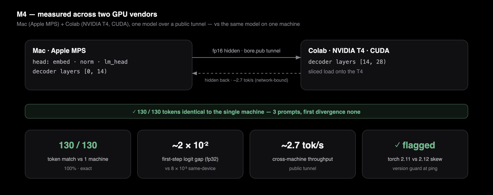

<h1 align="center">DRIFT</h1>

<p align="center"><b>Decentralized Routed Inference For Tokens — 1 つのモデルを、あなたの複数のマシンにまたがって分割。データセンター不要。</b></p>

<p align="center">
  <a href="./README.md">English</a> ·
  <a href="./README.ko.md">한국어</a> ·
  <a href="./README.zh.md">中文</a> ·
  <b>日本語</b>
</p>

<p align="center">
  
  
  
  
  &nbsp;
  
  
  
  
  &nbsp;
  
  
  
  
  
  
</p>

<p align="center">
  
</p>

<p align="center"><sub>ニューヨークの友人が眠っている間にノードを立てておき、あなたはソウルにいます。DRIFT は<b>1 つ</b>のモデルを両方のマシンに分割します — 友人の GPU が前半の層を、あなたの GPU が後半を計算し、hidden state が<b>暗号化された</b>ワイヤ上を<b>ノードからノードへ</b>ストリームし、すべてのホップが<b>レシートに署名</b>します。こうして、どちらの 1 台にも収まらないモデルを一緒に動かし、その答えは単一マシンと同じであることが証明できます。</sub></p>

<p align="center">
  
</p>

**DRIFT** は、**1 つ** の大規模言語モデルを **異種混在のパーソナルマシン** — Mac（Apple GPU、PyTorch **MPS**）と Windows/Linux PC（NVIDIA GPU、PyTorch **CUDA**）— にまたがって実行します。モデルを **レイヤー単位** で分割し（パイプライン並列）、ノード間では **hidden state** だけを **フレームワーク中立なバイトプロトコル**（TCP + msgpack）でストリーミングします。データセンターも、`torch.distributed` も、NCCL も、ベンダーロックもありません。データプレーンは *どの* フレームワークにも束縛されないため、本来なら決して会話できないはずのランタイム — Apple Metal のグラフと NVIDIA CUDA のグラフ — が、いまや 1 つのモデルを一緒に動かし、その出力は 1 台のマシンでモデル全体を実行した場合と **ビット単位で完全に一致** します。

その厳密な中核の上に、DRIFT は本物の **分散化レイヤー** を育ててきました。hidden state はいまや **ピアツーピア** でストリームし（ヘッドはもはや帯域のハブではありません）、ワイヤは **暗号化され、メンバーシップ認証** されます。脱落したノードは **ビット単位** で回復され、ヘッドは **重みを持たない** ことができ、すべてのホップが **レシートに署名** してヘッドがそれをライブトラフィック上で検証し、ノードは互いを **ゴシップで発見** し、その貢献は **台帳** に集計されます。

**差別化点を一言で:** [Exo](https://github.com/exo-explore/exo) はノード間通信を MLX（`mx.distributed`）に束縛しているため、*Apple シリコン間でしか動きません*。DRIFT はその境界を **中立で暗号化されたワイヤプロトコル** へと引き上げ — *異なるランタイム、異なる GPU ベンダー、1 つのモデル* — 分割が厳密であることを **ビット単位のパリティゲート** で証明し、ホップごとの署名付きレシートによって **自己検証可能** にします。どのフレームワークにも束縛されず、厳密であることが証明でき、しかもノードを信頼せずに検証できるデータプレーン — それが中核的な貢献です。

**スケール。** デコーダーレイヤー 1 つにつきノード 1 つ — デフォルトの Qwen で最大 **28 台**（Gemma は **35 台**）にまたがって 1 つのモデルを分割し、そのすべてでストリーミングします。現在のスイートスポットは **2〜4 台** です。

> *「トランスクリプトはモデルの出力そのものです。興味深いのは、その計算が実際に **どこで** 走ったのか — それがビット単位で辻褄が合い、ワイヤが暗号化され、すべてのホップが自らの仕事に署名したということです。」*

[**taewoopark.com** — 著者サイト](https://taewoopark.com)

---

## 目次

- [何が違うのか](#何が違うのか) — エンジニアが見に来た比較表
- [DRIFT とは](#drift-とは) — 名前、ビジョン、スコープ
- [5 つのプレーン](#5-つのプレーン) — 制御 / データ / KV / セキュリティ / 信頼
- [ワイヤ契約](#ワイヤ契約境界を実際に越えるもの) — スキーマ + トークンあたりのバイト数
- [3 つの正しさの問題](#正しい分割が解くべき-3-つの問題) — KV 再インデックス、RoPE、マスク
- [ピアツーピアと重みを持たないヘッド](#ピアツーピアと重みを持たないヘッド) — チェーン + 薄いヘッド
- [ノードを信頼せずに信頼する](#ノードを信頼せずに信頼する) — 暗号化、署名付きレシート、フェイルオーバー
- [正しさとパリティ](#正しさ--パリティゲート) — ビット単位のゲート + 実測結果
- [ベンチマーク](#ベンチマーク) — fidelity 100% · int8 でワイヤ ½ · O(1) ヘッド帯域
- [イントロスペクションによるモデル非依存](#イントロスペクションによるモデル非依存) — Qwen、Gemma、ハードコーディングなし
- [設計上の根拠（why-not）](#設計上の根拠why-not) — その判断とその理由
- [マイルストーン](#マイルストーン) · [クイックスタート](#クイックスタート) · [リポジトリマップ](#リポジトリマップ--どこを見るか) · [FAQ](#faq) · [実装済み vs まだビジョン](#実装済み-vs-まだビジョン)

---

## 何が違うのか

DRIFT の核心はすべて **ノード間の境界** にあります。その境界を従来技術と比較すると、次のようになります。

| | **DRIFT** | Exo | Petals | llama.cpp RPC | vLLM / Megatron PP |
|---|---|---|---|---|---|
| **分割単位** | デコーダーレイヤー | レイヤー | Transformer ブロック | レイヤー / テンソル | レイヤー（ステージ） |
| **ノード↔ノード間トランスポート** | **TCP + msgpack** | MLX `mx.distributed` | gRPC（torch テンソル） | カスタム RPC（ggml） | `torch.distributed` + NCCL |
| **フレームワーク中立なワイヤ** | **✅ はい** | ❌ MLX 依存 | ❌ torch 依存 | ggml 依存 | ❌ torch/NCCL 依存 |
| **異種 GPU ベンダー** | **✅ MPS + CUDA を同時に** | ❌ Apple のみ | 部分的 | ✅（ggml バックエンド） | ❌ NCCL は橋渡し不可 |
| **データプレーンのトポロジー** | **✅ ピアツーピアチェーン** | activation | activation | activation | activation |
| **ワイヤ暗号化 + ノード認証** | **✅ X25519 + ChaCha20 + PSK** | ❌ | ❌ | ❌ | ❌ |
| **自己検証（ホップごとに署名）** | **✅ Ed25519 レシート、ライブ** | ❌ | ❌ | ❌ | ❌ |
| **ビット単位で厳密なフェイルオーバー** | **✅ 再分割 + リプレイ** | ❌ | ~（再ルーティング） | ❌ | ❌ |
| **トークンあたりに越えるもの** | **約 1.5〜3 KB（hidden のみ）** | activation | activation | activation | activation |
| **正しさの契約** | **1 台のマシンに対するビット単位パリティ** | — | — | — | — |

この表を上から下まで読めば、主張はおのずと浮かび上がります。**どの実装も activation を受け渡している。だが、その受け渡しをフレームワーク中立で、暗号化され、ピアツーピアで、*しかも* ビット単位で厳密であることが証明できる形にし — そのうえモデルを再実行せずにノードが嘘をついていないか確かめられるようにしたのは、DRIFT だけだ。** NCCL は Apple GPU と NVIDIA GPU を同じプロセスグループに入れられません。MLX は Apple のエコシステムから出られません。DRIFT の答えは、ワイヤに *バイト以外の何も* 運ばせないこと — torch オブジェクトも、MLX 配列も、CUDA ハンドルもなし — です。そうすることで、2 つの世界は互いに実装可能な 1 つの契約の上で出会い、そのうえでその契約を堅牢にするのです。

---

## DRIFT とは

サーバーレスな P2P 推論ネットワーク。異種混在のパーソナルデバイスが **1 つ** のモデルをレイヤー単位で分割し、**一緒に** 実行します。ハイパースケーラーのデータセンターを経由する代わりに、*あなたのマシンと誰か他の人のマシン* が寄り集まって単一の AI を動かします。

名前がそのままシステムを表しています。

| 文字 | 意味 |
|---|---|
| **D** — Decentralized（非中央集権） | データセンターがない。hidden state は **ピアツーピア** でノードからノードへストリームし、ワイヤは暗号化 + メンバーシップ認証され、脱落したノードは回復されます。オーケストレーターが依然として実行を開始し、ヘッドは重みを持たないようにできます — 完全なリーダーレス合意形成は依然としてビジョンです（[実装済み vs まだビジョン](#実装済み-vs-まだビジョン) を参照）。 |
| **R** — Routed（経路制御） | オーケストレーターが hidden state をノード群へと *ルーティング* し、推論を前へ進める |
| **I** — Inference（推論） | ワークロードは LLM 推論（学習へも拡張可能） |
| **For T** — For Tokens（トークンのために） | 「トークン」の二重の意味 ― **推論** トークン（機械的思考の最小単位）**と**、**価値** トークン（貢献によって得られ、推論に費やされる）。いまやすべてのホップがレシートに署名し、`drift ledger` が貢献を集計します — これは支払いレイヤーが消費する入力です。思考の単位と価値の単位を 1 つにすること、それが DRIFT のビジョンです。 |

> **本リポジトリのスコープ。** 技術的な難所の中核 — *Mac と Windows マシンにまたがって分割されたモデルは正しい答えを出すのか？* — は出荷され、**ビット単位** で証明されています。その上で、**「For Tokens」** の土台はもはや図だけではありません。**ピアツーピアの暗号化データプレーン**、**ビット単位のフェイルオーバー**、**重みを持たないヘッド**、**ライブトラフィック上での署名付きレシート検証**、**ゴシップメンバーシップ**、そして **貢献台帳** はすべて実装され、ゲートで守られています。完全なトークンエコノミー、オンチェーン決済、そしてリーダーレス合意形成は、依然としてビジョンです。

---

## 5 つのプレーン

<p align="center"></p>

DRIFT は 5 つのプレーンにきれいに分離されます。

- **制御プレーン** — オーケストレーターは各ノードにレイヤー範囲を割り当て（`configure`）、デコードループを駆動します。ノードは 4 通りで見つかります — ゼロ設定の LAN ディスカバリ（mDNS）、明示的な `--nodes host:port` リスト、NAT 越しのノードが `drift node --tunnel` で開く公開 `bore.pub` トンネル、あるいは **ゴシップ** — ノードが 1 つのシードに `--join` すると、ネットワークが自身のメンバーシップを学習し、`drift run --expand` がそれにまたがって分割します。
- **データプレーン** — ステージの境界を越えるのは `hidden_states`（浮動小数点）+ `position_ids` + `input_ids`（整数）だけです。フレームワーク非依存であり、そして — ここが肝心ですが — そのサイズはパラメータ数ではなく `hidden_size` に依存します。**いまやこれはピアツーピアで流れます**（`--chain`）: ヘッド → n0 → n1 → … → テール → ヘッド。そのため、トークンあたりのテンソル越境は 2N から **N+1** へ減り、ヘッドの帯域はノード数に対して O(N) ではなく **O(1)** になります。オプションで **int8**（`--int8`）を使えばバイト数が半分になります。
- **KV キャッシュプレーン** — 各シャードは *自分自身* のレイヤー範囲の KV を、セッションごとに、自分のデバイス上で保持します。キャッシュがワイヤを越えることは決してありません（そうなればトークンあたり数メガバイトになり、設計を台無しにします）。移動するのは残差ストリームだけです。
- **セキュリティプレーン** — ネットワークは 1 つの事前共有鍵を共有します（`drift keygen`）。以降、すべての接続は X25519 ECDH → HKDF（PSK を混ぜる）→ ChaCha20-Poly1305 のチャネルを走らせるため、ストリームは秘匿され、鍵を持たない発信者は切断されます。`drift node --tunnel` は鍵なしでの実行を拒否し（公開された計算資源を野ざらしにしない）、長さプレフィックスには上限が設けられています（alloc-DoS 対策）。
- **信頼プレーン** — すべてのホップが `(in_hash, out_hash, レイヤー範囲)` に対して **Ed25519 レシート** に署名します。ヘッドは、実トラフィックの **すべてのトークン** について署名 + 隣接性 + 端点アンカーを検証します（別途のチャレンジではありません）。そのため、ワイヤの破損、脱落・偽造されたホップ、そして計算した内容と送った内容についてノードがつく嘘が、ライブで検出されます。脱落したノードは、生き残ったノードにまたがって再分割しリプレイすることで、**ビット単位** で回復されます。

**分割は 2 台を超えて拡張します** — デコーダーレイヤー 1 つにつきノード 1 つ、最大 28 台（Gemma は 35 台）まで、ヘッドとワイヤは不変のままです。

<p align="center"></p>

---

## ワイヤ契約（境界を実際に越えるもの）

この契約（`drift/protocol.py`）は **凍結** されています。すべてのメッセージは **4 バイトのビッグエンディアン長さプレフィックス + msgpack の辞書** です（ネットワーク鍵が設定されている場合は、1 つの ChaCha20-Poly1305 フレームとして暗号化されます）。将来のどんなランタイム — MLX、ggml、JAX、Rust ノード — も、このフレーミングを実装しさえすれば参加できます。ワイヤ上に PyTorch は存在しません。

```jsonc
// リクエスト（オーケストレーター → シャード、またはチェーンモードではシャード → シャード）
{
  "type":         "prefill" | "decode" | "reset" | "ping" | "configure",
  "session_id":   "s0",               // 1 つの生成シーケンス
  "seq_id":       42,                 // 単調増加、順序付け / デバッグ用
  "shape":        [1, 1, 1536],       // hidden_states の形状（decode: S=1）
  "dtype":        "float16" | "int8",  // int8 → ワイヤ半減（非可逆）
  "scale":        "<per-group fp16>",  // int8 逆量子化スケール（fp16 では不在）
  "position_ids": [37],               // 絶対位置  → RoPE、シャード上で計算
  "input_ids":    [785],              // トークン id → レイヤーごとの埋め込み（PLE）/ thin-head の埋め込み
  "tensor":       "<raw bytes>",       // 行優先の hidden_states
  "route":        [["10.0.0.2", 52601]], // チェーンモード: 下流のノード群
  "collect":      ["10.0.0.9", 6000]     // チェーンモード: ヘッドの収集先（sink）
}

// レスポンス（シャード → 次のホップ / ヘッド）
{ "ok": true, "shape": [1,1,1536], "dtype": "float16", "tensor": "<bytes>",
  "receipt": { "node": "<pubkey>", "in_hash", "out_hash", "start", "end", "sig" },
  "token":  785 }   // thin-head のテールはテンソルの代わりにトークン id を返す
```

`route` / `collect` は **追加的かつオプション** です — これらを持たないノードは、従来のスター型とまったく同じように振る舞います。`configure` は **fungible な（交換可能な）** ノードにレイヤー範囲（および thin-head の端点の役割）を割り当てるため、ユーザーが範囲を手書きすることは決してありません。

**トークンあたりのバイト数。** デコード中、activation は `[1, 1, hidden]` です。Qwen の `hidden = 1536` なら fp16 で **3 072 バイト**、int8 なら **1 560 バイト**（H の int8 + グループごとの fp16 スケール ≈ 0.51×）です。チェーンはトークンあたり `N+1` 回の越境を行い、スターは `2N` 回です。LAN 上では、計算量に比べれば取るに足らない量です。

**なぜワイヤ上の fp16 が安全なのか（ビット単位）。** シリアライズは CPU 上での fp16 ラウンドトリップです。計算 dtype が fp16 であれば、このラウンドトリップは **ビット単位で無損失** です — これこそが、分割経路が 1 台のマシンを近似的にではなく *厳密に* 再現できる前提です。int8 は無損失では *なく*、オプトインです。int8 は緩和されたゲートの下で走り、ビット単位のゲートでは決して走りません。

---

## 正しい分割が解くべき 3 つの問題

レイヤーをプロセス間で分割するのは些細なことに聞こえます — 出力を未分割のモデルと *完全に同一* にしようとするまでは。厄介な点が 3 つあり、DRIFT はそのそれぞれを明示的に処理します。

### 1 · KV キャッシュのインデックス付け — 見落としやすい問題

Hugging Face の `DynamicCache` は「過去の長さ（past length）」を **レイヤー 0 の** スロットから報告します。グローバルなレイヤー `[14, 28)` を保持するシャードが、そのグローバルインデックスをそのまま再利用すると、キャッシュのスロット 0 が **空** のままになります — その結果、デコード中に因果マスクが *過去が存在しない* かのように構築され、ごく最初のトークンの後でパリティが静かに壊れます。

<p align="center"></p>

DRIFT は、ロード時に各シャードが保持するレイヤーを **ローカルな 0 始まり** のキャッシュスロットへ再インデックスし、セッションごとの `DynamicCache` のサイズをそのシャードのローカルなレイヤー数に合わせます。

### 2 · RoPE の自己計算 — ワイヤを小さく保つ

回転位置埋め込み（RoPE）は `position_ids` にのみ依存します。そのため各シャードは、モデル自身の `rotary_emb` を通じて **絶対** 位置から自分の `cos/sin` を計算します。境界を越えるのは、完全な `cos/sin` テンソルではなく、ほんの一握りの整数だけであり、各ノードは自己完結的なままです。

### 3 · ステージごとのアテンションマスク

prefill ではマスクは因果的にフル（causal-full）であり、decode では KV 長を考慮したものになります。DRIFT は、インストール済みの Transformers のマスク生成ユーティリティを使って各シャード上でマスクを再構築します。マスクはレイヤー自身のアテンションタイプに基づいて **レイヤーごとに** 選択されます（Gemma はローカル/グローバルを交互に切り替えます）— 何一つハードコードされていません。

---

## ピアツーピアと重みを持たないヘッド

**チェーンストリーミング（`--chain`）。** すべてのホップをヘッド経由でスター型にルーティングする代わりに、hidden state は経路に沿ってノードからノードへと流れ、テールが最終状態をヘッドの collect シンクへ届けます。2 つの利点があります。トークンあたりのテンソル越境が **2N から N+1** へ減ること、そして — ここが肝心ですが — ヘッドのデータプレーン帯域がノード数に対して O(N) ではなく **O(1)** になることです。ヘッドは、すべての activation が通り抜けるハブであることをやめます。

**薄いヘッド（`--thin`）。** ヘッドは **モデルの重みをゼロ** で保持できます。`embed_tokens` は最初のノードの役割へ、`norm` + `lm_head` + `argmax` は最後のノードの役割へ移ります。チェーンと組み合わせると、ヘッドはパイプラインへ **1 つの整数トークン id** を送り込み、**1 つの整数トークン id** を受け取ります — テンソル演算を一切行わず、パラメータを一切実体化しません。パリティが保たれるのは、`norm`+`lm_head`+`argmax` が、ビット単位で同一の hidden state に対し、同じ（tied な）重みを使って同じデバイス上で走るからです — argmax は、それをヘッドとテールのどちらが計算するかに対して不変です。

デコードループは、差し替え可能なトランスポートの上に **一度だけ** 書かれます。差し替えられるのはトランスポート（プロセス内 / スター / チェーン）だけなので、マイルストーン間の唯一の変数はネットワークであり、いかなる回帰も *証明可能な形で* トランスポートのバグであって、決してロジックのバグではありません。

<p align="center"></p>

---

## ノードを信頼せずに信頼する

**暗号化され、認証されたワイヤ（`drift keygen`）。** ネットワークは 1 つの 32 バイトの事前共有鍵を共有します。鍵付きの接続は、X25519 ECDH（一時鍵 → 前方秘匿性）→ PSK を混ぜた HKDF-SHA256 → 方向ごとのカウンタ nonce を用いた ChaCha20-Poly1305 を行います。PSK を KDF に混ぜることがメンバーシップのチェックになります。鍵を持たないピアは異なる鍵を導出し、その最初のフレームは復号に失敗します。鍵なしはローカル開発向けに平文のままです。鍵の設定はネットワーク全体で行います。

**ライブトラフィック上での署名付きレシート。** すべてのホップが `(session, seq, mode, レイヤー範囲, in_hash, out_hash)` に対して Ed25519 レシートに署名します。**トークンごとに**、ヘッドは署名、隣接性（ホップ *i* の `out_hash` == ホップ *i+1* の `in_hash`）、および端点アンカー（最初のホップの入力がヘッドの送ったものと一致し、最後のホップの出力がヘッドの受け取ったものと一致する）を確認します。改ざんを行うノードは、通常の生成の中で捕捉され — 誠実に振る舞えばよい別途のチャレンジは存在しません — ローカルのレピュテーションテーブルで SUSPECT（疑わしい）と記録されます。*これが捕捉するもの:* ワイヤの破損、脱落・並べ替え・偽造されたホップ、計算した内容と送った内容についてつく嘘。*捕捉しないもの*（一貫して誤計算し、その結果に署名するノード）は、再計算監査（`drift verify`）または冗長な N-of-M 実行（将来）の役割です。

<p align="center"></p>

**ビット単位のフェイルオーバー。** 生成の途中でノードが死んでも、もはやセッションは終わりません。オーケストレーターは、生き残ったノード（および予備のノード）にまたがってモデルを再分割し、これまでのシーケンスを再 prefill して各ノードの KV を再構築し、再開します。greedy デコードは固定されたプレフィックスに対して決定論的であるため、再開された続きは、一度も脱落しなかった場合と **ビット単位で同一** です — デコードの途中でノードを kill し、完成したシーケンスを中断のないリファレンスと照合して検証済みです。

**貢献台帳。** ヘッドは検証済みのすべてのレシートをジャーナルに記録します。`drift ledger` はそれをノードごとの集計（運んだトークン数、提供したレイヤートークン数、セッション数）へと畳み込み、`--verify` ですべての署名を再確認し、`--csv` でエクスポートします。これが決済レイヤーの入力となる土台です。

---

## 正しさ — パリティゲート

DRIFT は **正しさ優先（correctness-first）** です。ネットワークを介するすべてのステップは、いかなる性能改善や分散化の作業よりも前に、1 台のマシンによるリファレンスを **ビット単位で** 再現しなければなりません。速度は主眼ではありません — *異種混在の分割推論が厳密であること* こそが主眼であり、上記のすべての機能はそれに照らしてゲートされます。

**実測結果** — Qwen2.5-1.5B-Instruct、Apple MPS、fp16:

| ゲート | 何を切り分けるか | 結果 |
|---|---|---|
| **プロセス内** 2 シャード | シャーディング · RoPE · KV · マスク | ✅ **6 / 6 プロンプトがビット単位**（`n = 1…180`） |
| **TCP スター** 2 プロセス | シリアライズ / フレーミング | ✅ **ビット単位で == リファレンス** |
| **チェーン** 2・3 ノード | ピアツーピアのリレー | ✅ **ビット単位で == リファレンス** |
| **チェーン + 暗号化** | AEAD チャネルの透過性 | ✅ **ビット単位**（暗号化はトークンを乱さない） |
| **薄いヘッド** 2・3 ノード | 重みを持たないヘッド、端点の embed/lm_head | ✅ **ビット単位** |
| **デコード中に kill**（チェーン / スター、入口 / 中間 / テール） | フェイルオーバーのリプレイ | ✅ **48 / 48 ビット単位**、回復が発動 |
| **ノードを改ざん** | ライブのレシート検証 | ✅ **ライブトラフィックで捕捉**、誠実な実行では疑わしいノード 0 |
| **MPS ↔ CUDA（M4）** | ベンダーまたぎの fp16 丸め | ✅ 3 プロンプトで **130 / 130 トークン** 一致 |

**MPS ↔ CUDA（M4）。** 前半を Mac（Apple MPS）、後半を Colab の NVIDIA T4（CUDA）で実行したところ、分割は単一マシンを **厳密に再現しました（130/130 トークン）** — 2 つのベンダーの fp16 カーネルが初手の logit 差を ~2×10⁻²（同一デバイスは ~8×10⁻³）へ広げたにもかかわらず、ここでは argmax を反転させるには至りませんでした。より大きな規模ではこの差が後半のトークンを反転させ得るため、そのための **緩和されたゲート** `python -m drift.parity_test --prefix-match K` があります。

<p align="center"></p>

---

## ベンチマーク

*単一マシンの数字は `python -m drift.bench` で、統合ゲートは `python -m drift.itest …` で再現できます。*

**Fidelity — 分割は出力を変えるか？** *（分割経路 vs 単一マシンのオラクル、greedy）*

| 指標 | 結果 |
|---|---|
| トークン完全一致 — プロンプト 6 個、`n = 1…180` | **411 / 411 = 100.00 %** |
| 初手 logit 最大絶対差 (fp32) | 7.81 × 10⁻³ *(fp16 ULP)* |
| KL ダイバージェンス (nats) | ≤ 2.82 × 10⁻¹⁰ |

**Footprint — どの単一ノードもモデル全体を保持しない**（最も重いノードでも重みの **42 %**、計算分担ではなくデバイス上で実測）。各ノードは自分のスライスだけを実体化するため（`init_empty_weights` + safetensors の選択的読み込み）、モデル全体がどの 1 台にも常駐することはありません。

**ワイヤは薄く、ピアツーピアで、オプションで半分のサイズにできる**

| 指標 | 値 |
|---|---|
| トークンあたり・ホップあたりのワイヤ (fp16) | **3.10 KB** — hidden state のみ |
| トークンあたり・ホップあたりのワイヤ (**int8**) | **1.52 KB** — fp16 の 51 %（実測 fidelity ~67 %、緩和） |
| トークンあたりのテンソル越境 — スター → **チェーン** | 2N → **N+1** |
| ヘッドのデータプレーン帯域 — スター → **チェーン** | O(N) → **O(1)** |
| プロトコルオーバーヘッド（localhost、fp16 スター） | ホップあたり ~1.2 ms、~41 ms/token の計算に圧倒される |

> チェリーピックした勝利ではなく、絶対的で再現可能な数字です。Apple のみのクラスタでは Exo のネイティブ MLX 経路が生スループットで勝ります。DRIFT の軸は *異種混在で、厳密で、検証可能* であること — そこでは競合はそもそも動きません。

---

## イントロスペクションによるモデル非依存

エンジンはモデルアーキテクチャを一切ハードコードしません。ロード時に、ロードされたモデルを **イントロスペクト（内省）** して適応します — 真実の源はロードされたモデルであって、固定のクラスではありません。まったく異なる 2 つのファミリーが *同じ* エンジンにそのまま乗ります。

| モデル | レイヤー → 分割 | DRIFT が処理する癖（イントロスペクトで判別、決してハードコードしない） |
|---|---|---|
| **Qwen/Qwen2.5-1.5B-Instruct** *(主)* | 28 → `0–14 / 14–28` | プレーンなデコーダー、単一の RoPE θ、`DynamicCache`、tied な `lm_head` — 正しさのベースライン |
| **google/gemma-4-E2B-it** *(副)* | 35 → `0–18 / 18–35` | **Per-Layer Embeddings** · sqrt(hidden) の埋め込みスケーリング · **二重の RoPE θ** · **ハイブリッドな** スライディング/グローバルアテンション · `HybridCache` + KV 共有グループ; `transformers ≥ 5.5` が必要 |

どの癖もいずれかのプレーンにきれいに対応づけられ、ロード時に `config`/シグネチャから発見されます。だからこそ、Qwen を動かすコードが、変更なしで Gemma を動かすのです。*観測できるものに依存せよ、何もハードコードするな。*

**この 2 つの先へ:** 上の表はパリティスイートでビット単位の検証を済ませた*ゲート済み*ファミリーです。同じイントロスペクションは、DRIFT の制約内にある**あらゆる decoder-only Hugging Face causal LM** を受け止めるよう設計されています（インストール済みの `transformers` が対応するアーキテクチャ、ノード合計メモリに収まる fp16 重み）。`drift run --model <hf-id>`（または `config.yaml` の `model_id`）で指定すれば、分割・ワイヤサイズ・レイヤープランは自動的に再導出されます — 新しいモデルも `python -m drift.parity_test` で同じ基準を通してください。詳細は[運用マニュアル §6](docs/manual.ja.md)。

---

## 設計上の根拠（why-not）

- **なぜノード間で `torch.distributed` / NCCL を使わないのか？** NCCL は Apple Metal デバイスと NVIDIA CUDA デバイスを 1 つのプロセスグループに置くことができません — 議論の余地なく。しかもこれはデータプレーンをバックエンドに結合してしまい、それこそが DRIFT の拒むものです。
- **なぜスターではなくピアツーピアチェーンなのか？** スターはヘッドを O(N) の帯域ハブ — すべての activation が通り抜ける単一の地点 — にしてしまいます。チェーンはそれを O(1) へ落とし、特権を手放したヘッドの前提条件になります。
- **なぜ抜き取り検査ではなく、すべてのホップでレシートに署名するのか？** 固定のチャレンジは、チャレンジのときだけ誠実なノードにすり抜けられます。検証を実トラフィックに結びつければ、選択的に誠実になれる対象が存在しなくなります。
- **なぜ KV を複製するのではなく、フェイルオーバー時に再 prefill するのか？** 複製は設計が拒む帯域です。再 prefill は一度きりの O(シーケンス長) であり — greedy が決定論的なので — ビット単位で厳密です。v1 にとっては、正しくて安価であることが、シームレスで重いことに勝ります。
- **なぜテンソルごとではなく、グループごとの int8 なのか？** 残差ストリームには外れ値のチャネルがあり、テンソルごとに 1 つのスケールでは他のすべてが潰れてしまいます（実測: 一致 0%）。128 次元ブロックごとに 1 つのスケールを持てば、ワイヤを ~半減しつつ fidelity を使える水準に保てます。
- **なぜ M0 の時点でワイヤを凍結するのか？** ノードの内部を、いつまでも一斉切り替え（flag day）なしに変更できるようにするためです。`route` / `collect` / `scale` はすべて *オプション* フィールドとして追加されました — 破壊的変更は一度もありません。

---

## マイルストーン

| # | マイルストーン | ステータス |
|---|---|---|
| **M0–M3** | 環境 · リファレンスオラクル · プロセス内 + TCP 2 シャードのパリティ | ✅ **ビット単位** |
| **M4** | マシン間 — Mac MPS + NVIDIA CUDA | ✅ **実測** — 130/130 トークン |
| **M6** | 穏当な kill-node の検出 | ✅ 綺麗な `NodeUnavailable` |
| **M7** | ピアツーピアチェーンのデータプレーン | ✅ **ビット単位** · 2N→N+1 越境、O(1) ヘッド |
| **M8** | 暗号化 + 認証されたワイヤ（PSK + X25519 + ChaCha20） | ✅ **ビット単位** · 改ざんトンネルを封鎖 |
| **M9** | ビット単位のフェイルオーバー — 再分割 + リプレイ | ✅ 実行途中の kill 後も **48/48 ビット単位** |
| **M10** | 薄いヘッド — 重みゼロのオーケストレーター | ✅ **ビット単位** |
| **M11** | ライブトラフィック上での署名付きレシート検証 | ✅ 改ざんを **ライブで捕捉**、誠実な実行はクリーン |
| **M12** | ゴシップメンバーシップ + 動的参加 | ✅ シードが全体を学習、ヘッドが拡張 + 分割 |
| **M13** | 貢献台帳（`drift ledger`） | ✅ 集計が整合、偽造行は棄却 |
| **M14** | WAN 性能 — グループごとの int8 ワイヤ | ✅ **ワイヤ半減**、実測 fidelity ~67% |
| **M15** | ドキュメント刷新 — この README | ✅ |

上記のすべては `drift itest` によって実行されます（実際のローカルノードを起動し、分割をプロセス内リファレンスに照らしてゲートします）。投機的デコーディング、リーダーレス合意形成、そしてトークンエコノミーはビジョンであって、出荷されていません — 下記を参照してください。

---

## クイックスタート

Python **3.12** と [`uv`](https://github.com/astral-sh/uv) が必要です。デフォルトの 2 つのモデルはどちらも **ゲートなし** です — Hugging Face のログインは不要です。

**1 · インストール** — 各マシンで:

```bash
git clone https://github.com/TaewoooPark/DRIFT && cd DRIFT
bash scripts/install.sh          # macOS / Linux   ·   Windows: powershell -File scripts\install.ps1
drift doctor                     # checks Python, torch, device, config, ports
```

**2 · 1 台のマシンで試す:**

```bash
drift up 2                       # 2 local nodes, auto-split, open a chat
drift up 3 --chain               # peer-to-peer: nodes stream to each other
drift up 2 --thin                # weightless head (embed + lm_head on the nodes)
drift up 2 --int8                # half-size wire (lossy, opt-in)
```

**3 · あなたの Mac + CUDA PC にまたがって 1 つのモデルを実行する** — これが本命です。

```bash
# Windows/Linux PC (NVIDIA)     — one terminal
drift node --port 52601        # device = cuda, announced on the LAN

# Mac (Apple)                  — terminal 1: a worker
drift node --port 52600        # device = mps

# Mac                          — terminal 2: the head (type the prompt)
drift run --chain --prompt "hello world"
```

**ワイヤを暗号化する**（1 つの鍵をマシン間で共有）:

```bash
drift keygen                     # prints DRIFT_NETWORK_KEY=<hex>
export DRIFT_NETWORK_KEY=<hex>   # on every machine — the wire is now encrypted + authenticated
```

**どこからでも参加** — NAT 越しのノードがトンネルを開き、ゴシップでネットワークに加わります:

```bash
drift node --tunnel --join bore.pub:PORT      # needs a network key (no open compute)
drift run --expand --nodes bore.pub:PORT      # discover the whole membership, split across it
```

**誰が何を計算したか:**

```bash
export DRIFT_JOURNAL=~/drift.jsonl && drift run --chain --prompt "…"
drift ledger ~/drift.jsonl --verify           # per-node contribution, signatures re-checked
```

**OpenAI 互換のローカルバックエンドとして配信** — モデルは引き続き DRIFT
ノード群に分散して実行され、クライアント向けの表面だけが HTTP/SSE になります:

```bash
drift serve --nodes 127.0.0.1:52600,127.0.0.1:52601 --api-key local-dev
```

対応する text-generation の表面には `/v1/models`、`/v1/chat/completions`、
`/v1/completions`、`/v1/responses`、hidden state を公開できるモードでの
`/v1/embeddings`、tokenizer helpers、health/readiness、metrics が含まれます。
複数候補 (`n`) と OpenAI 形状の logprobs を受け付け、logits を公開できる DRIFT
実行では実際の logits に基づく selected-token/top-k logprobs を返します。
Tool-call と JSON response-format は API shape 互換レイヤーとして提供され、
Responses streaming は semantic SSE events を送出します。DRIFT は tools を
サーバー側で実行せず、厳密な schema-constrained decoding も保証しません。
Multimodal/audio と thin-mode sampling/embeddings は明示的な OpenAI 形状の
unsupported error を返します。対応範囲は
[docs/openai-compatibility.md](docs/openai-compatibility.md)、チェックリスト監査、
Python/JS SDK smoke、残る full-stack gate は
[docs/openai-compatibility-audit.md](docs/openai-compatibility-audit.md) にまとめています。

**カスタマイズとチューニング** — モデル、分割点、デバイス、トラブルシューティング — はすべて **運用マニュアル → [docs/manual.ja.md](docs/manual.ja.md)** にあります（[English](docs/manual.md) · [한국어](docs/manual.ko.md) · [中文](docs/manual.zh.md)）。

**ライブで見る** — [**DRIFT-Demo**](https://github.com/TaewoooPark/DRIFT-Demo)：実際の実行を 2 画面で可視化するデモです — ワイヤを渡る residual stream、レイヤーごとの ‖Δh‖、テイルノード自身が計算する top-k、署名レシート、貢献台帳まで、すべてのピクセルがライブトラフィックから描かれ、DRIFT のソースには一切手を加えていません。

---

## リポジトリマップ — どこを見るか

```text
drift/
  protocol.py       # 契約そのもの — 4B の長さプレフィックス + msgpack; fp16/int8 テンソルの ser/deser
  crypto.py         # ネットワーク鍵 + ノード識別子; X25519+ChaCha20 チャネル; keygen
  engine_torch.py   # PyTorch シャード: イントロスペクトされたレイヤー呼び出し、ローカル KV 再インデックス、self-RoPE  ← 要
  loader.py         # スライス重み — init_empty_weights + ノードが実行するシャードだけ
  shard_server.py   # 並行 TCP サーバー: ping / configure / prefill / decode / relay / gossip
  orchestrator.py   # ヘッド + 差し替え可能なトランスポート（プロセス内 / スター / チェーン）+ デコードループ + 検証器
  run.py, node.py   # `drift run` ヘッド + `drift node` ワーカー（自動分割・ディスカバリ・トンネル・--join）
  receipts.py       # ホップごとの署名付きレシート + ライブ検証器 + ジャーナル（台帳のソース）
  membership.py     # ゴシップのピアテーブル — 署名付きエントリ、アンチエントロピー、--expand
  ledger.py         # `drift ledger` — レシートジャーナルからのノードごとの貢献
  verify.py         # トラストレスな抜き取り（再計算監査 — ライブレシートを補完）
  parity_test.py    # プロセス内 / TCP のビット単位ゲート + マルチプロンプト --selftest
  itest.py          # 実ノードでの統合ゲート: chain / secure / thin / kill / tamper / expand / ledger / int8
  bench.py, bench_m4.py   # 単一マシン + マシン間（M4）ベンチマーク
config.yaml         # モデル、dtype、ポート、シャードテーブル
```

**レビュアー向けの要点リスト:** `engine_torch.py`（KV 再インデックス + イントロスペクション）、`protocol.py`（凍結されたワイヤ）、`orchestrator.py`（差し替え可能なトランスポート + チェーン + 検証器）、`receipts.py`（信頼レイヤー）。

---

## FAQ

**これは単なるパイプライン並列では？** *アイデア* はそうですが、貢献は **境界** にあります。vLLM/Megatron の PP は `torch.distributed`+NCCL に溶接されており、MPS↔CUDA を橋渡しできません。DRIFT の境界は、ピアツーピアで流れる中立で暗号化されたバイトです — ビット単位で厳密であることが証明され、自己検証可能です。

**ネットワークは私のトークンを見るのか？** 冷静に捉えましょう。`input_ids` は整数のトークン id ですが、これは *可逆* なエンコーディングです — （公開されている）トークナイザーを持つ者なら誰でもそれをあなたのテキストに戻せますし、下流のシャードはそれを必要とします。ですから、ワイヤを暗号化しない限り **ノード運営者はあなたのプロンプトを読めます。** `drift keygen` + `DRIFT_NETWORK_KEY` は、鍵を共有するノードに対してストリームを秘匿します。それがなければ DRIFT は平文です（自分の所有する LAN なら問題ありません）。そして、ノードが自身の計算について嘘をついていないか確かめられます — すべてのホップがレシートに署名してヘッドがライブで検証し、`drift verify` は自分が所有していないノードを再計算監査します。

**生成の途中でノードが死んだらどうなるのか？** セッションは生き残ります。DRIFT は生き残ったノード（および予備のノード）にまたがって再分割し、これまでのシーケンスをリプレイして継続します — 一度も脱落しなかった場合とビット単位で同一です。シームレスな（リプレイなしの）フェイルオーバーはまだありません。それには複製が必要です。

**3 つ目のノードを追加できるのか？** はい — `drift up 3`、あるいは `drift run --expand` ですべてのメンバーをゴシップで発見し、そのすべてにまたがって分割できます。ワイヤ契約は変わりません。

**なぜリファレンスは CPU ではなく MPS 上なのか？** 計算 dtype が fp16 であり、PyTorch の CPU fp16 カーネルは信頼できないからです。MPS は fp16 を正しく決定論的に実行するので、パリティのベースラインは MPS 上にあります。CPU/CUDA は設定で切り替え可能です。

---

## 実装済み vs まだビジョン

難所の中核 — 正しく、**ビット単位で検証された** 異種分割 — は完了しました。その上の分散化レイヤーは、図ではなく **実装され、ゲートで守られて** います。

| 能力 | 実装済み | マイルストーン |
|---|---|---|
| 1 台に大きすぎるモデルを実行（シャードごとのロード） | ✅ | v0.10–0.16 |
| ピアツーピアのデータプレーン（ヘッドのハブなし） | ✅ | M7 |
| 暗号化 + 認証されたワイヤ | ✅ | M8 |
| 脱落ノードでのビット単位フェイルオーバー | ✅ | M9 |
| 重みを持たないヘッド | ✅ | M10 |
| 自己検証 — ライブトラフィック上の署名付きレシート | ✅ | M11 |
| ゴシップメンバーシップ + どこからでも参加 | ✅ | M12 |
| 貢献台帳 | ✅ | M13 |
| 半分サイズの int8 ワイヤ | ✅ | M14 |

**まだビジョンなもの**（正直に言えば）: リーダーレスな **合意形成**（依然としてオーケストレーターが各実行を開始します）、**Sybil 耐性**（ゴシップのエントリは自己主張であり、加入制御はありません）、価格設定 / 支払い / オンチェーン決済を伴う **トークンエコノミー**（台帳は入力であって、決済ではありません）、**シームレスなフェイルオーバー**（複製、つまりリプレイなし）、**投機的デコーディング**（シャードごとの KV ロールバックが必要）、そして **N-of-M の冗長実行**（一貫して誤計算するノードを捕捉するため。ライブレシートだけでは捕捉できません）。これらはロードマップです — *「P2P で、暗号化され、自己検証可能で、耐障害性のある異種推論ネットワークであり、そのすべてのステップが 1 台のマシンと証明可能な形で同一である」*（今日すでに真）と、*「完成した分散型トークンエコノミー」*（まだ）との違いです。

---

## 連絡先

<p align="center">
  <a href="https://github.com/TaewoooPark"></a>
  <a href="https://x.com/theoverstrcture"></a>
  <a href="https://www.linkedin.com/in/taewoo-park-427a05352"></a>
  <a href="https://www.instagram.com/t.wo0_x/"></a>
  <a href="https://taewoopark.com"></a>
  <a href="mailto:ptw151125@kaist.ac.kr"></a>
</p>

<p align="center"><sub>データセンターなし。torch.distributed なし。あなたのマシンと誰か他の人のマシンが、1 つの精神を動かす — ピアツーピアで、暗号化され、署名付きで、ビット単位で。</sub></p>
