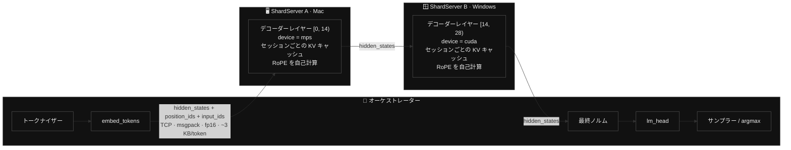
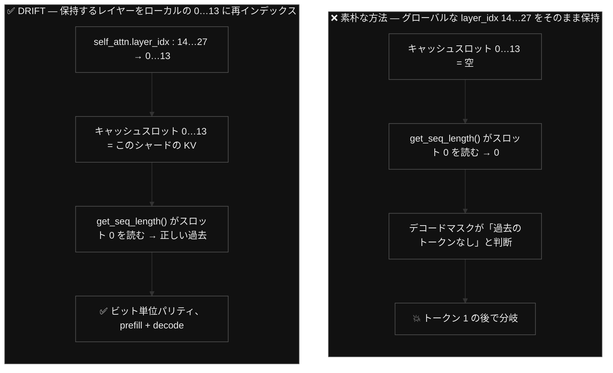
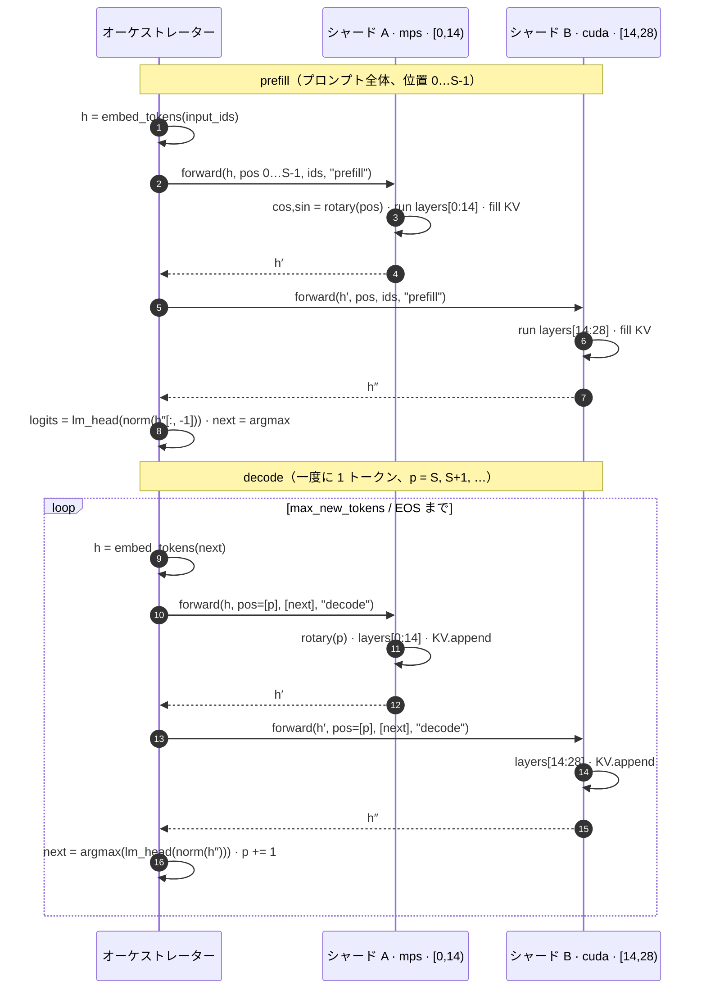
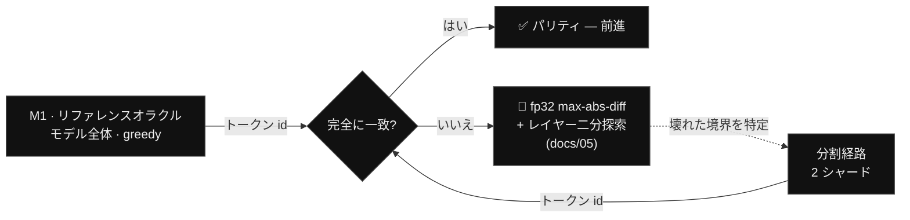

<h1 align="center">DRIFT</h1>

<p align="center"><b>Decentralized Routed Inference For Tokens — 1 つのモデルを、あなたの複数のマシンにまたがって分割。データセンター不要。</b></p>

<p align="center">
  <a href="./README.md">English</a> ·
  <a href="./README.ko.md">한국어</a> ·
  <a href="./README.zh.md">中文</a> ·
  <b>日本語</b>
</p>

<p align="center">
  
  
  
  
  &nbsp;
  
  
  
  
  
  &nbsp;
  
  
  
  
  
</p>

**DRIFT** は、**1 つ** の大規模言語モデルを **異種混在のパーソナルマシン** — Mac（Apple GPU、PyTorch **MPS**）と Windows PC（NVIDIA GPU、PyTorch **CUDA**）— にまたがって実行します。モデルを **レイヤー単位** で分割し（パイプライン並列）、ノード間では **hidden state** だけを **フレームワーク中立なバイトプロトコル**（TCP + msgpack）でストリーミングします。データセンターも、`torch.distributed` も、NCCL も、ベンダーロックもありません。データプレーンは *どの* フレームワークにも束縛されないため、本来なら決して会話できないはずのランタイム — Apple Metal のグラフと NVIDIA CUDA のグラフ — が、いまや 1 つのモデルを一緒に動かし、その出力は 1 台のマシンでモデル全体を実行した場合と **ビット単位で完全に一致** します。

**差別化点を一言で:** [Exo](https://github.com/exo-explore/exo) はノード間通信を MLX（`mx.distributed`）に束縛しているため、*Apple シリコン間でしか動きません*（ロードマップ上、Windows は「Longer term」）。DRIFT はその境界を **中立なワイヤプロトコル** へと引き上げ — *異なるランタイム、異なる GPU ベンダー、1 つのモデル* — 分割が厳密であることを **ビット単位のパリティゲート** で証明します。どのフレームワークにも束縛されないデータプレーンこそが中核的な貢献です。

> *「トランスクリプトはモデルの出力そのものです。興味深いのは、その計算が実際に **どこで** 走ったのか — そしてそれがビット単位で辻褄が合ったということです。」*

[**taewoopark.com** — 著者サイト](https://taewoopark.com)

---

## 目次

- [何が違うのか](#何が違うのか) — エンジニアが見に来た比較表
- [DRIFT とは](#drift-とは) — 名前、ビジョン、スコープ
- [アーキテクチャ](#アーキテクチャ) — 制御 / データ / KV プレーン
- [ワイヤ契約](#ワイヤ契約境界を実際に越えるもの) — スキーマ + トークンあたりのバイト数
- [3 つの正しさの問題](#正しい分割が解くべき-3-つの問題) — KV 再インデックス、RoPE、マスク
- [デコードループ](#デコードループと差し替え可能なトランスポート) — シーケンス + 差し替え可能なトランスポート
- [正しさとパリティ](#正しさ--パリティゲート) — ビット単位のゲート + 実測結果
- [イントロスペクションによるモデル非依存](#イントロスペクションによるモデル非依存) — Qwen、Gemma 4、そしてハードコーディングなし
- [設計上の根拠（why-not）](#設計上の根拠why-not) — その判断とその理由
- [マイルストーン](#マイルストーン) · [クイックスタート](#クイックスタート) · [リポジトリマップ](#リポジトリマップ--どこを見るか) · [FAQ](#faq) · [ロードマップ](#ロードマップ)

---

## 何が違うのか

DRIFT の核心はすべて **ノード間の境界** にあります。その境界を従来技術と比較すると、次のようになります。

| | **DRIFT** | Exo | Petals | llama.cpp RPC | vLLM / Megatron PP |
|---|---|---|---|---|---|
| **分割単位** | デコーダーレイヤー | レイヤー | Transformer ブロック | レイヤー / テンソル | レイヤー（ステージ） |
| **ノード↔ノード間トランスポート** | **TCP + msgpack** | MLX `mx.distributed` | gRPC（torch テンソル） | カスタム RPC（ggml） | `torch.distributed` + NCCL |
| **境界ペイロード** | **生の fp16 バイト + 整数** | MLX 配列 | torch オブジェクト | ggml テンソル | torch テンソル / NCCL バッファ |
| **フレームワーク中立なワイヤ** | **✅ はい** | ❌ MLX 依存 | ❌ torch 依存 | ggml 依存 | ❌ torch/NCCL 依存 |
| **異種 GPU ベンダー** | **✅ MPS + CUDA を同時に** | ❌ Apple のみ | 部分的 | ✅（ggml バックエンド） | ❌ NCCL は橋渡し不可 |
| **Mac + Windows を併用** | **✅** | ❌（「Longer term」） | ~ | ✅ | ❌ |
| **インターフェース越しにエンジン差し替え可能** | **✅ `ShardEngine` ABC** | ❌ | ❌ | n/a | ❌ |
| **KV キャッシュの配置** | シャードごと、ローカル | シャードごと | ブロックごと | ノードごと | ステージごと |
| **トークンあたりに越えるもの** | **約 3 KB（hidden のみ）** | activation | activation | activation | activation |
| **正しさの契約** | **1 台のマシンに対するビット単位パリティ** | — | — | — | — |

この表を上から下まで読めば、主張はおのずと浮かび上がります。**どの実装も activation を受け渡している。だが、その受け渡しをフレームワーク中立にし、*しかも* 結果がビット単位で厳密であることを証明したのは DRIFT だけだ。** NCCL は Apple GPU と NVIDIA GPU を同じプロセスグループに入れられません。MLX は Apple のエコシステムから出られません。DRIFT の答えは、ワイヤに *バイト以外の何も* 運ばせないこと — torch オブジェクトも、MLX 配列も、CUDA ハンドルもなし — です。そうすることで、2 つの世界は互いに実装可能な 1 つの契約の上で出会えるのです。

---

## DRIFT とは

サーバーレスな P2P 推論ネットワーク。異種混在のパーソナルデバイスが **1 つ** のモデルをレイヤー単位で分割し、**一緒に** 実行します。ハイパースケーラーのデータセンターを経由する代わりに、*あなたのマシンと誰か他の人のマシン* が寄り集まって単一の AI を動かします。

名前がそのままシステムを表しています。

| 文字 | 意味 |
|---|---|
| **D** — Decentralized（非中央集権） | 単一のコントローラーも、単一障害点もない。異種混在のデバイスが対等な P2P ノードとして参加する |
| **R** — Routed（経路制御） | オーケストレーターが hidden state をノード群へと *ルーティング* し、推論を前へ進める |
| **I** — Inference（推論） | ワークロードは LLM 推論（学習へも拡張可能） |
| **For T** — For Tokens（トークンのために） | 「トークン」の二重の意味 ― **推論** トークン（機械的思考の最小単位）**と**、**価値** トークン（貢献によって得られ、推論に費やされる）。思考の単位と価値の単位を 1 つにすること、それが DRIFT のビジョンである |

> **本リポジトリのスコープ。** これは **D·R·I** の部分 — *異種混在の分割推論* — の動作するデモです。**「For Tokens」** の経済レイヤー（トラストレスな検証、トークンエコノミー、グローバルな P2P ディスカバリ）はビジョンであり **将来の課題** として、ここでは意図的にスコープ外としています。今日出荷されるのは、技術的に難しい中核部分です。*Mac と Windows マシンにまたがって分割されたモデルは、本当に正しい答えを出すのか？* — その答えは、証明可能な形で「イエス」です。

---

## アーキテクチャ



DRIFT は 3 つのプレーンにきれいに分離されます。

- **制御プレーン** — オーケストレーターは、設定で定めた固定の順序でシャードを呼び出します。ディスカバリサービスもリーダー選出もなく、アドレスのリストは `config.yaml` にあります。（ディスカバリは「For Tokens」側の関心事であり、スコープ外です。）
- **データプレーン** — ステージの境界を越えるのは `hidden_states`（浮動小数点）と `position_ids` + `input_ids`（整数）だけです。フレームワーク非依存であり、そして — ここが肝心ですが — **そのサイズはパラメータ数ではなく `hidden_size` に依存します。** `hidden_size` が一致すれば、1.5 B のモデルも 70 B のモデルも、同じ約 3 KB/token を送出します。
- **KV キャッシュプレーン** — 各シャードは *自分自身* のレイヤー範囲の KV を、セッションごとに、自分のデバイス上で保持します。**キャッシュがワイヤを越えることは決してありません**（そうなればトークンあたり数メガバイトになり、設計全体が台無しになります）。移動するのは残差ストリームだけです。

---

## ワイヤ契約（境界を実際に越えるもの）

この契約（`drift/protocol.py`）は **凍結** されています。すべてのメッセージは **4 バイトのビッグエンディアン長さプレフィックス + msgpack の辞書** です。将来のどんなランタイム — MLX、ggml、JAX、Rust ノード — も、このフレーミングを実装しさえすればパイプラインに参加できます。ワイヤ上に PyTorch は存在しません。

```jsonc
// リクエスト（オーケストレーター → シャード）
{
  "type":         "prefill" | "decode" | "reset" | "ping",
  "session_id":   "s0",               // 1 つの生成シーケンス
  "seq_id":       42,                 // 単調増加、順序付け / デバッグ用
  "shape":        [1, 1, 1536],       // hidden_states の形状（decode: S=1）
  "dtype":        "float16",
  "position_ids": [37],               // 絶対位置  → RoPE、シャード上で計算
  "input_ids":    [785],              // トークン id → レイヤーごとの埋め込み（PLE, Gemma 4）
  "tensor":       "<raw fp16 bytes>"  // 行優先の hidden_states
}

// レスポンス（シャード → オーケストレーター）
{ "ok": true, "shape": [1,1,1536], "dtype": "float16", "tensor": "<bytes>", "error": null }

// ping レスポンス  →  { "ok": true, "name", "start_layer", "end_layer", "device" }
```

**トークンあたりのバイト数。** デコード中、activation は fp16 の `[1, 1, hidden]` = `hidden × 2` バイトです。Qwen の `hidden = 1536` なら **3 072 バイト ≈ 3 KB** となり、これに `position_id` が 1 つ、`input_id` が 1 つ、そして数バイトの msgpack フレーミングが加わります。2 シャードのパイプラインでは、トークンあたり約 4 回の越境が発生し（オーケストレーター→A、A→オーケストレーター、オーケストレーター→B、B→オーケストレーター）、**トークンあたり約 12 KB のワイヤトラフィック** になります — LAN では、計算量に比べれば取るに足らない量です。

**なぜこの 3 つのフィールドだけなのか:**

- `hidden_states` — 残差ストリーム。下流のレイヤーが本当に必要とする唯一のもの。
- `position_ids` — 各シャードが絶対位置から **自分自身の** RoPE を計算するため（後述）。事前計算した `cos/sin` ではなく位置そのものを送ることで、ペイロードは極小に、ノードは自己完結的に保たれます。
- `input_ids` — **M0** の時点で予約済み。これにより、契約を再凍結することなく **Per-Layer-Embedding** モデル（Gemma 4）が動作します。下流のシャードが、レイヤーごとの埋め込み信号をトークン id からローカルに再構築するのです。プレーンなモデル（Qwen）は単にこれを無視します。

**なぜワイヤ上の fp16 が安全なのか。** シリアライズは CPU 上での fp16 ラウンドトリップです。送出時は `tensor.detach().to("cpu", float16).contiguous().numpy().tobytes()`、受信時は `np.frombuffer(buf, np.float16).reshape(shape).copy()`。計算 dtype がすでに fp16 であれば、このラウンドトリップは **ビット単位で無損失** です — これこそが、分割経路が 1 台のマシンを近似的にではなく *厳密に* 再現できる前提なのです。

---

## 正しい分割が解くべき 3 つの問題

レイヤーをプロセス間で分割するのは些細なことに聞こえます — 出力を未分割のモデルと *完全に同一* にしようとするまでは。厄介な点が 3 つあり、DRIFT はそのそれぞれを明示的に処理します。ここにこそ本当のエンジニアリングがあり — レビュアーが精査すべき箇所です。

### 1 · KV キャッシュのインデックス付け — 見落としやすい問題

Hugging Face の `DynamicCache` はレイヤーの `layer_idx` でインデックスされ、「過去の長さ（past length）」を **レイヤー 0 の** スロットから報告します。グローバルなレイヤー `[14, 28)` を保持するシャードが、そのグローバルインデックスを素朴にそのまま再利用すると、キャッシュのスロット 0 が **空** のままになります — その結果、デコード中に因果マスクが *過去が存在しない* かのように構築され、ごく最初のトークンの後でパリティが静かに壊れます。



DRIFT は、ロード時に各シャードが保持するレイヤーを **ローカルな 0 始まり** のキャッシュスロットへ再インデックスし、セッションごとの `DynamicCache` のサイズをそのシャードのローカルなレイヤー数に合わせます。プロセス内では、2 つのシャードが 1 つのロード済みモデルを共有できます — それぞれが **互いに素な** レイヤーオブジェクトを所有しているため、一方を再インデックスしても他方には決して影響しないからです。

### 2 · RoPE の自己計算 — ワイヤを小さく保つ

回転位置埋め込み（RoPE）は `position_ids` にのみ依存し、どのレイヤーがそれを消費するかには依存しません。そのため各シャードは、モデル自身の `rotary_emb` モジュールを通じて **絶対** 位置から自分の `cos/sin` を計算します — レイヤー `[14, 28)` を保持するシャードでも、正しく求められます。したがって境界を越えるのは、完全な `[S, head_dim]` の `cos/sin` テンソルではなく、ほんの一握りの整数だけであり、各ノードは自己完結的なままです。

### 3 · ステージごとのアテンションマスク

prefill ではマスクは因果的にフル（causal-full）であり、decode では KV 長を考慮したものになります。DRIFT は、インストール済みの Transformers のマスク生成ユーティリティ（`create_causal_mask`、および Gemma のようにレイヤーごとにローカル/グローバルアテンションを交互に切り替えるモデル向けの `create_sliding_window_causal_mask`）を使って、各シャード上でマスクを再構築します。マスクはレイヤー自身のアテンションタイプに基づいて **レイヤーごとに** 選択されます — 何一つハードコードされていません。

---

## デコードループと差し替え可能なトランスポート



このループは、単一のシグネチャを持つ **差し替え可能なトランスポート** — `transport(shard, session, hidden, position_ids, input_ids, mode)` — を経由します。デコードループは **一度だけ** 書かれ、差し替えられるのはトランスポートだけです。

| トランスポート | マイルストーン | 境界 | 目的 |
|---|---|---|---|
| **プロセス内呼び出し** | M2 | 直接 `engine.forward(...)`、ソケットなし | 分割ロジックを単独で検証する |
| **ソケットクライアント** | M3+ | TCP 上の §6 プロトコル | シリアライズ / フレーミングを検証する |

ループが同一であるため、**M2 と M3 の間の唯一の変数はネットワークだけ** です — したがって M3 で回帰が起きれば、それは *証明可能な形で* シリアライズのバグであり、ロジックのバグではあり得ません。これはこのコードベースにおいて最も重要な構造上の決定です。

---

## 正しさ — パリティゲート

DRIFT は **正しさ優先（correctness-first）** です。ネットワークを介するすべてのステップは、いかなる性能改善作業よりも前に、1 台のマシンによるリファレンスを **ビット単位で** 再現しなければなりません。速度はこのデモの主眼ではありません — *異種混在の分割推論が厳密であること* こそが主眼です。



**実測結果** — Qwen2.5-1.5B-Instruct、Apple MPS、fp16:

| ゲート | 何を切り分けるか | 結果 |
|---|---|---|
| **M0** ping | 中立プロトコルの到達性 | ✅ 両シャードが応答 |
| **M2** プロセス内 2 シャード | シャーディング · RoPE · KV · マスク | ✅ **50 / 50 トークン id がビット単位で == リファレンス** |
| **M3** TCP 2 プロセス | シリアライズ / フレーミング | ✅ **50 / 50 ビット単位で == リファレンス** |
| **`--selftest`**（6 プロンプト） | 1 つのプロンプトへの過適合 | ✅ **6 / 6 ビット単位** — 英語 · コード · 韓国語; `n = 1, 40, 50, 60, 80, 180` |

`--selftest` は最も強力な証拠です。新鮮なリファレンスを改めて導出し、プロンプトの *種類*（散文、ソースコード、韓国語）と *長さ*（単一トークンの生成から 180 トークンのデコードまで）にわたって比較します。すべてのトークン id が一致し — 6 つすべてで最初の分岐インデックスは `None` です。

**MPS ↔ CUDA（M4）。** 真にマシンをまたぐステップに至って初めて、2 つの GPU ベンダーのカーネルは fp16 を異なる形で丸めます。そのため greedy デコーディングは *後半の* トークンで分岐する可能性があります — これは想定内であり、**緩和されたゲート**（序盤のトークンが一致 + 出力に一貫性がある）で扱います。トークン 1〜2 での分岐は浮動小数点ノイズではなく **バグ** です → 二分探索へ。まさにこのための手引きが **[docs/05-parity-debugging-playbook.md](docs/05-parity-debugging-playbook.md)** です。

この実装は **2 回連続で全項目 OK** となるまでレビューされました — 正しさに加え、Exo/Petals/llama.cpp との設計比較まで含め — Exo の結合に関する主張を Exo 自身のソースコードで検証しています。台帳: **[docs/07-review-log.md](docs/07-review-log.md)**。

---

## イントロスペクションによるモデル非依存

エンジンはモデルアーキテクチャを一切ハードコードしません。ロード時に、ロードされたモデルを **イントロスペクト（内省）** して適応します。

```python
# drift/engine_torch.py — 真実の源はロードされたモデルであって、固定のクラスではない
layer_cls   = type(self.layers[0])                       # Qwen2DecoderLayer / Gemma4DecoderLayer / …
self._layer_params = set(inspect.signature(layer_cls.forward).parameters)
self.rotary       = self.inner.rotary_emb                # 自己計算する RoPE、どのモデルでも
self.has_sliding  = getattr(self.inner, "has_sliding_layers", False)
self.layer_types  = [cfg.layer_types[i] for i in range(start, end)]   # レイヤーごとのアテンションタイプ
# … 呼び出し時には、このバージョンのレイヤーが実際に受け取る kwargs だけを渡す:
call_kwargs = {k: v for k, v in call_kwargs.items() if k in self._layer_params}
```

だからこそ、まったく異なる 2 つのモデルファミリーが *同じ* エンジンにそのまま乗るのです。

| モデル | レイヤー → 分割 | ゲート | DRIFT が処理するアーキテクチャ上の癖（イントロスペクトで判別、決してハードコードしない） |
|---|---|---|---|
| **Qwen/Qwen2.5-1.5B-Instruct** *(主)* | 28 → `0–14 / 14–28` | なし | プレーンなデコーダー、単一の RoPE θ、`DynamicCache`、tied な `lm_head` — 正しさのベースライン |
| **google/gemma-4-E2B-it** *(副)* | 35 → `0–18 / 18–35` | なし（Apache-2.0） | **Per-Layer Embeddings**（シャードが `input_ids` から自己計算）· sqrt(hidden) の埋め込みスケーリング（オーケストレーター）· ローカル/グローバルの **二重 RoPE θ** · レイヤーごとのスライディング/グローバルアテンションの **ハイブリッド** · `HybridCache` + KV 共有グループ · 最終ロジットの softcap なし; `transformers ≥ 5.5` が必要 |

Gemma 4 の癖はそれぞれ、いずれかのプレーンにきれいに対応づけられます — **オーケストレーター**（埋め込みスケーリング）、**シャード**（二重 θ の RoPE、ハイブリッドマスク、ハイブリッドキャッシュ）、あるいは **ワイヤ**（PLE のための `input_ids`）— そしてそのどれもが、ロード時に `config`/シグネチャから発見されます。だからこそ、Qwen を動かすコードが、変更なしで Gemma 4 を動かすのです。これは、中立なワイヤが体現するのと同じ原則がもたらす、モデル非依存の恩恵です。*観測できるものに依存せよ、何もハードコードするな。*

---

## 設計上の根拠（why-not）

興味深い決定とは、DRIFT が採らなかった選択肢のことです。そのそれぞれが、仕様における厳格な制約となっています。

- **なぜノード間で `torch.distributed` / NCCL / gloo を使わないのか？** NCCL は Apple Metal デバイスと NVIDIA CUDA デバイスを 1 つのプロセスグループに置くことができません — 議論の余地なく。しかもこれらはいずれも *データプレーン* を特定のバックエンドに結合してしまい、それこそが DRIFT の拒むものです。ワイヤは中立なバイトなので、ランタイム同士はフレーミング以外に何も合意する必要がありません。
- **なぜノード間で KV キャッシュを送らないのか？** KV はトークンあたり数メガバイトに達し、シーケンス長とともに増大します。これを送れば約 3 KB の残差をはるかに上回り、コスト効率を破壊してしまいます。各シャードは自分の KV をローカルに保持し、移動するのは残差ストリームだけです。
- **なぜワイヤ上は fp16 なのか（fp32 ではなく）？** fp16 計算であれば、CPU 上の fp16 ラウンドトリップはビット単位で無損失なので、シリアライズがパリティを乱すことはあり得ません — しかも fp32 に対してワイヤのバイト数を半減できます。（fp16 計算は速度の出る GPU 上で動きます。CPU の fp16 カーネルは信頼できず、それがパリティのベースラインを CPU ではなく MPS で走らせる理由です。）
- **なぜまず逐次・単一セッションなのか？** 並行処理、バッチ処理、投機的デコーディングは最適化です。このデモの価値は *異種混在の下での正しさ* にあるので、それらはパリティが証明されるまで先送りされます — そして実際に証明済みです。
- **なぜ各ノードでモデル全体をロードするのか（v1）？** 単純さと正しさのためです。メモリ効率のよい経路（`init_empty_weights` + シャードごとの safetensors）は既知の後続課題です。v1 はモデル全体をロードして自分のスライスだけを使いますが、これは自明に正しく、1.5〜4 B のモデルならラップトップに収まります。
- **なぜ M0 の時点でワイヤ契約を凍結するのか？** ノードの内部を、いつまでも一斉切り替え（flag day）なしに変更できるようにするためです。`input_ids` フィールドは、まさに PLE モデル（Gemma 4）が破壊的変更を一切強いないよう、凍結の *前に* 追加されました。

---

## マイルストーン

| # | マイルストーン | 必要なもの | ステータス |
|---|---|---|---|
| **M0** | 環境 + 中立プロトコルのフレーミング（ping） | Mac | ✅ 完了 |
| **M1** | 1 台のマシンによるリファレンスオラクル | Mac | ✅ 完了 |
| **M2** | プロセス内 2 シャードのパリティ（ネットワークなし） | Mac | ✅ **ビット単位** |
| **M3** | localhost 2 プロセスのパリティ（TCP） | Mac | ✅ **ビット単位** |
| **M4** | マシン間 — Mac MPS + Windows CUDA | + Windows | ⬜ 2 台目のノードが必要 |
| **M5** | ブース展示 + インタラクティブなストリーミング | + Windows | ⬜ |
| **M6** | ノード切断からの穏当な回復 | + Windows | ⬜ |

Mac のみで完結するトラック（M0–M3）は、エンジニアリングの約 80 %、そして **正しさに関するリスクの 100 %** を占めます — 完了かつレビュー済みです。M4–M6 が加えるのは、2 台目のマシンと展示だけです。

---

## クイックスタート

Python **3.12**（PyTorch にはまだ 3.14 の wheel がありません）と [`uv`](https://github.com/astral-sh/uv) が必要です。デフォルトの 2 つのモデルはどちらも **ゲートなし** です — Hugging Face のログインは不要です。

```bash
git clone https://github.com/TaewoooPark/DRIFT && cd DRIFT

# 1 · 隔離された環境 + 依存関係（torch の macOS arm64 wheel にはすでに MPS が含まれる）
uv venv --python 3.12 .venv && source .venv/bin/activate
uv pip install "torch" "transformers>=5.5" safetensors msgpack numpy huggingface_hub accelerate pyyaml
export PYTORCH_ENABLE_MPS_FALLBACK=1

# 2 · M1 — リファレンスオラクルを構築           （Qwen2.5-1.5B を一度だけダウンロード）
python -m drift.reference                        # → reference_out.npz、28 レイヤー、一貫したテキスト

# 3 · M2 — プロセス内 2 シャードのパリティ            （M1 とビット単位で等しくなければならない）
python -m drift.parity_test --mode inprocess     # → PASS 50/50

# 4 · 頑健性 — 6 プロンプト、英語/コード/韓国語、n = 1…180
python -m drift.parity_test --selftest           # → ALL PASS
```

**M3 — 2 つのプロセスにまたがる本物の TCP**（2 つのシャードサーバー + オーケストレーター）:

```bash
# ターミナル A — Mac シャード、レイヤー [0,14)
DRIFT_PORT=52600 python -m drift.shard_server --name mac     --start 0  --end 14 --device mps --preload
# ターミナル B — 2 つ目のシャード、レイヤー [14,28)
DRIFT_PORT=52601 python -m drift.shard_server --name windows --start 14 --end 28 --device mps --preload
# ターミナル C — ヘルスチェック、次にワイヤ越しのパリティ、そして生成
python -m drift.orchestrator --ping    --ports 52600,52601      # → M0 ping: PASS
python -m drift.parity_test  --mode socket --ports 52600,52601  # → PASS 50/50 over TCP
python -m drift.orchestrator --prompt "Explain pipeline parallelism." --ports 52600,52601
```

すべては **`config.yaml`** で設定します — モデル id、dtype、ポート、そしてシャードごとのレイヤー範囲 + デバイス。Gemma 4 を試すには、`model_id: google/gemma-4-E2B-it` を設定し、分割を `0–18 / 18–35` にします。

---

## リポジトリマップ — どこを見るか

```text
drift/
  protocol.py       # 契約そのもの — 4B の長さプレフィックス + msgpack; fp16 テンソルの ser/deser
  engine_base.py    # ShardEngine ABC — ランタイム差し替えの継ぎ目
  engine_torch.py   # PyTorch シャード: イントロスペクトされたレイヤー呼び出し、ローカル KV 再インデックス、self-RoPE  ← 要
  shard_server.py   # TCP サーバー: ping / reset / prefill / decode
  orchestrator.py   # embed + norm + lm_head + sampler; 差し替え可能なトランスポート; デコードループ
  reference.py      # M1 1 台のマシンによるオラクル
  parity_test.py    # M2/M3 ゲート + マルチプロンプト --selftest
  common.py         # config + 同一のトークン化（オラクルと分割経路で共有）
config.yaml         # モデル、dtype、ポート、シャードテーブル
docs/               # 01 実装計画 · 02 ワークフロー · 03 目標 · 04 skills/MCP · 05 パリティ手引き · 06 セットアップ · 07 レビューログ
```

**レビュアー向けの要点リスト:** `engine_torch.py`（KV 再インデックス + イントロスペクション）、`protocol.py`（凍結されたワイヤ）、`orchestrator.py`（差し替え可能なトランスポート + デコードループ）、そして `docs/05`（パリティのデバッグ方法）。

---

## FAQ

**これは単なるパイプライン並列では？** *アイデア* はそうですが、貢献は **境界** にあります。vLLM/Megatron の PP は `torch.distributed`+NCCL に溶接されており、MPS↔CUDA を橋渡しできません。DRIFT の境界は中立なバイトなので、異種のベンダーが参加でき — しかもビット単位で厳密であることが証明されています。

**ネットワークは私のトークンを見るのか？** ワイヤを越えるのは整数の `input_ids` と浮動小数点の `hidden_states` だけです — テキストもなければ、KV もありません。LAN 上であれば、これはあなたのマシン群の中にとどまります。（暗号化や信頼は「For Tokens」側の関心事であり、ここではスコープ外です。）

**3 つ目のノードを追加できるのか？** はい — 分割は `config.yaml` 内のレイヤー範囲のリストです。シャードのエントリを追加すれば、オーケストレーターが順番にそこを経由してルーティングします。ワイヤ契約は変わりません。

**なぜリファレンスは CPU ではなく MPS 上なのか？** 計算 dtype が fp16 であり、PyTorch の CPU fp16 カーネルが信頼できないからです。MPS は fp16 を正しく決定論的に実行するので、M1–M3 はすべて MPS 上で行われ、ビット単位で一致します。CPU/CUDA は設定で切り替え可能です。

**バッチ処理やスループットは？** 設計上、先送りしています（正しさ優先）。分割が厳密であることを証明するには逐次の単一セッションで十分であり、バッチ処理は将来の課題です。

**なぜ特に Qwen と Gemma 4 なのか？** どちらもゲートなし（ライセンスの壁がない）で、アーキテクチャ空間の両極 — プレーンなデコーダーと、Per-Layer Embeddings + ハイブリッドアテンションを備えたもの — をカバーします。これが「イントロスペクトせよ、ハードコードするな」というエンジンのストレステストになります。

---

## ロードマップ

- **M4 — マシン間。** LAN 越しに 1 つのモデルを Mac（MPS）+ Windows（CUDA）で実行。想定される MPS↔CUDA の浮動小数点の分岐に対する緩和されたパリティゲート。両ノードにわたるバージョン固定の検証。
- **M5 — ブース展示。** 各ノードが自分のライブなレイヤー範囲 + デバイスを表示。オーケストレーターは *「前半は Apple GPU が考え、後半は NVIDIA が考える」* という形でトークンをストリーミングします。
- **M6 — 穏当なノード切断。** デコード中に脱落したシャードを検出 → 通知 → 再構成/再起動（シームレスなフェイルオーバーはなし — それにはレプリケーションが必要）。
- **v2 — エンジン差し替え。** 同じ `ShardEngine` インターフェースの背後に置く `engine_mlx.py` — ワイヤは凍結されたまま、変わるのはノードの内部だけです。ここでフレームワーク中立という主張が報われます。MLX シャードと CUDA シャードで、1 つのモデル。

---

## 連絡先

<p align="center">
  <a href="https://github.com/TaewoooPark"></a>
  <a href="https://x.com/theoverstrcture"></a>
  <a href="https://www.linkedin.com/in/taewoo-park-427a05352"></a>
  <a href="https://www.instagram.com/t.wo0_x/"></a>
  <a href="https://taewoopark.com"></a>
  <a href="mailto:ptw151125@kaist.ac.kr"></a>
</p>

<p align="center"><sub>データセンターなし。torch.distributed なし。あなたのマシンと誰か他の人のマシンが、1 つの精神を動かす — そしてそれはビット単位で辻褄が合う。</sub></p>

