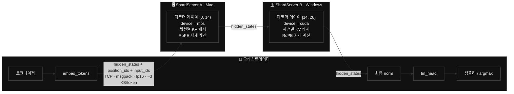
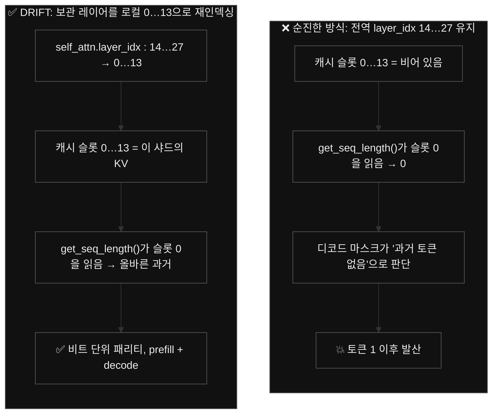
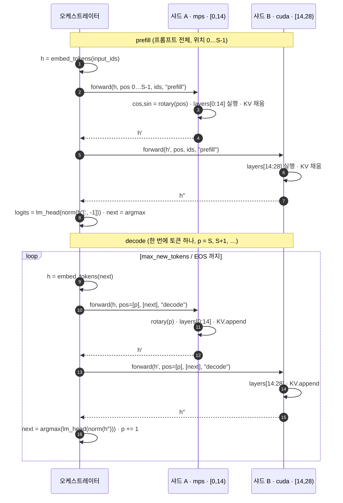
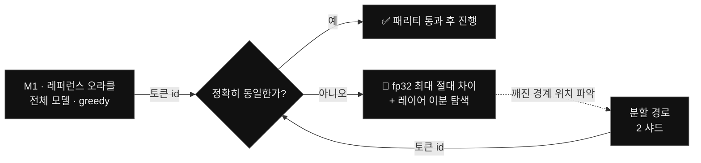

<h1 align="center">DRIFT</h1>

<p align="center"><b>Decentralized Routed Inference For Tokens. 하나의 모델을 당신의 여러 머신에 쪼개어, 데이터센터 없이.</b></p>

<p align="center">
  <a href="./README.md">English</a> ·
  <b>한국어</b> ·
  <a href="./README.zh.md">中文</a> ·
  <a href="./README.ja.md">日本語</a>
</p>

<p align="center">
  
  
  
  
  &nbsp;
  
  
  
  
  
  &nbsp;
  
  
  
  
  
  
</p>

**DRIFT**는 **하나의** 대규모 언어 모델을 **이종(heterogeneous) 개인 머신들**, 곧 Mac(Apple GPU, PyTorch **MPS**)과 Windows PC(NVIDIA GPU, PyTorch **CUDA**)에 걸쳐 실행하되, 모델을 **레이어 단위로** 분할(파이프라인 병렬화, pipeline parallelism)하고 노드 사이로는 오직 **hidden state**만을 **프레임워크 중립 바이트 프로토콜**(TCP + msgpack) 위로 흘려보내는 방식을 취한다. 데이터센터도, `torch.distributed`도, NCCL도, 벤더 종속도 개입하지 않는바, 데이터 플레인(data plane)이 *어떤* 프레임워크에도 묶여 있지 않기에 서로 결코 대화할 수 없던 런타임, 곧 Apple Metal 그래프와 NVIDIA CUDA 그래프가 비로소 하나의 모델을 함께 돌릴 수 있으며, 그 출력은 전체 모델을 단일 머신에서 실행한 결과와 **비트 하나까지 동일하다**. 이종성(heterogeneity) 아래에서도 연산의 정확성이 조금도 훼손되지 않는다는 점, 바로 그것이 본 저장소가 겨냥하는 핵심이다.

**한 줄로 요약한 차별점:** [Exo](https://github.com/exo-explore/exo)는 노드 간 통신을 MLX(`mx.distributed`)에 결박해 둔 탓에 *Apple 실리콘 대 Apple 실리콘 전용*에 머무는바(Windows는 로드맵상 "Longer term"으로 미뤄져 있다), 이종 협업의 여지가 원천적으로 닫혀 있다. 그러나 DRIFT는 그 경계를 **중립 와이어 프로토콜**로 끌어올림으로써(*서로 다른 런타임, 서로 다른 GPU 벤더, 하나의 모델*) 분할이 정확함을 **비트 단위 패리티 게이트(bitwise parity gate)**로 입증한다. 결국 어떤 프레임워크에도 묶이지 않은 데이터 플레인, 바로 그것이 본 프로젝트의 핵심 기여라 하여도 과언이 아니다.

**확장.** 디코더 레이어 하나당 노드 하나 — 기본 Qwen 기준 최대 **28대**(Gemma는 **35대**)에 걸쳐 하나의 모델을 쪼개 스트리밍한다. 현재 모델 특성상 스위트 스팟은 **2~4대**다.

> *"트랜스크립트는 모델의 출력일 뿐이다. 흥미로운 지점은 그 연산이 실제로 **어디서** 돌았는가, 그리고 그것이 비트 하나까지 맞아떨어졌다는 사실이다."*

[**taewoopark.com** 저자 사이트](https://taewoopark.com)

---

## 목차

- [무엇이 다른가](#무엇이-다른가): 엔지니어들이 찾던 바로 그 비교 표
- [DRIFT란 무엇인가](#drift란-무엇인가): 이름, 비전, 그리고 범위
- [아키텍처](#아키텍처): 제어 / 데이터 / KV 플레인
- [와이어 계약](#와이어-계약-경계를-실제로-넘는-것): 스키마 + 토큰당 바이트
- [세 가지 정확성 문제](#올바른-분할이-풀어야-할-세-가지-문제): KV 재인덱싱, RoPE, 마스크
- [디코드 루프](#디코드-루프와-주입-가능한-전송-계층): 시퀀스 + 주입 가능한 전송 계층
- [정확성 & 패리티](#정확성과-패리티-게이트): 비트 단위 게이트 + 측정 결과
- [벤치마크](#벤치마크): fidelity 100% · 노드당 모델의 ≤ 42% · 프로토콜 오버헤드 ≈ 0
- [인트로스펙션을 통한 모델 독립성](#인트로스펙션을-통한-모델-독립성): Qwen, Gemma 4, 그리고 하드코딩 없음
- [설계 근거 (why-not)](#설계-근거-왜-아닌가): 그 결정들과 이유
- [마일스톤](#마일스톤) · [빠른 시작](#빠른-시작) · [저장소 지도](#저장소-지도-어디를-봐야-하는가) · [FAQ](#faq) · [로드맵](#로드맵)

---

## 무엇이 다른가

DRIFT의 핵심은 전적으로 **노드 사이의 경계**에 있다. 그 경계를 선행 기술과 비교하면 다음과 같다:

| | **DRIFT** | Exo | Petals | llama.cpp RPC | vLLM / Megatron PP |
|---|---|---|---|---|---|
| **분할 단위** | 디코더 레이어 | 레이어 | 트랜스포머 블록 | 레이어 / 텐서 | 레이어(스테이지) |
| **노드↔노드 전송** | **TCP + msgpack** | MLX `mx.distributed` | gRPC(torch 텐서) | 커스텀 RPC(ggml) | `torch.distributed` + NCCL |
| **경계 페이로드** | **원시 fp16 바이트 + 정수** | MLX 배열 | torch 객체 | ggml 텐서 | torch 텐서 / NCCL 버퍼 |
| **프레임워크 중립 와이어** | **✅ 예** | ❌ MLX 종속 | ❌ torch 종속 | ggml 종속 | ❌ torch/NCCL 종속 |
| **이종 GPU 벤더** | **✅ MPS + CUDA 동시** | ❌ Apple 전용 | 부분적 | ✅ (ggml 백엔드) | ❌ NCCL로는 연결 불가 |
| **Mac + Windows 동시** | **✅** | ❌ ("Longer term") | ~ | ✅ | ❌ |
| **인터페이스 뒤에서 엔진 교체 가능** | **✅ `ShardEngine` ABC** | ❌ | ❌ | 해당 없음 | ❌ |
| **KV 캐시 위치** | 샤드별, 로컬 | 샤드별 | 블록별 | 노드별 | 스테이지별 |
| **토큰당 넘어가는 것** | **~3 KB (hidden만)** | 액티베이션 | 액티베이션 | 액티베이션 | 액티베이션 |
| **정확성 계약** | **단일 머신 대비 비트 단위 패리티** | 없음 | 없음 | 없음 | 없음 |

표를 위에서 아래로 훑어 내려가면 논지는 저절로 드러난다: **액티베이션(activation)을 전달한다는 점은 모두가 같으나, 그 전달을 프레임워크 중립으로 만들고 *동시에* 결과가 비트 단위로 정확함까지 입증하는 것은 오직 DRIFT뿐이다.** NCCL은 Apple GPU와 NVIDIA GPU를 같은 프로세스 그룹에 담을 수 없으며, MLX 또한 Apple 생태계를 벗어나지 못한다. 이에 대한 DRIFT의 답은 와이어가 *바이트 외에는 아무것도*, 곧 torch 객체도, MLX 배열도, CUDA 핸들도 실어 나르지 않게 하는 것인바, 그리하여 두 세계가 비로소 서로 구현 가능한 단 하나의 계약 위에서 만나게 된다.

---

## DRIFT란 무엇인가

서버가 존재하지 않는 피어투피어(peer-to-peer) 추론 네트워크로서, 이종 개인 기기들이 **하나의** 모델을 레이어 단위로 분할하여 **함께** 실행한다. 하이퍼스케일러(hyperscaler)의 데이터센터를 경유하는 대신 *당신의 머신과 다른 누군가의 머신*이 한자리에 모여 단 하나의 AI를 돌리는 것인바, 지능이 어느 한 곳에 고이지 않고 흩어진 기계들 위로 흘러 다니게 된다는 데에 그 발상의 원점이 있다.

이름이 곧 시스템이다:

| 글자 | 의미 |
|---|---|
| **D**: Decentralized(탈중앙) | 단일 컨트롤러도, 단일 장애점도 없다. 이종 기기들이 대등한 P2P 노드로 참여한다 |
| **R**: Routed(라우팅) | 오케스트레이터가 노드들을 거쳐 hidden state를 *라우팅*하여 추론을 앞으로 밀고 나간다 |
| **I**: Inference(추론) | 워크로드는 LLM 추론이다(학습으로 확장 가능) |
| **For T**: For Tokens(토큰을 위하여) | "토큰"의 이중 의미: **추론** 토큰(기계 사고의 원자) **그리고** **가치** 토큰(기여로 벌고, 추론에 쓴다). DRIFT의 비전은 사고의 단위와 가치의 단위를 하나로 만드는 것이다 |

> **본 저장소의 범위.** 본 저장소는 **D·R·I** 조각, 곧 *이종 분할 추론*의 동작하는 데모에 해당한다. **"For Tokens"**의 경제 계층(신뢰 없는 검증, 토큰 이코노미, 전역 P2P 디스커버리)은 비전이자 **향후 과제**인 만큼 여기서는 의도적으로 범위에서 제외된다. 다만 오늘 공개되는 것은 결코 사소하지 않은 기술적 핵심, 곧 *Mac과 Windows 박스에 걸쳐 분할한 모델이 과연 올바른 답을 내놓는가?* 라는 물음이며, 그 답은, 증명 가능한 형태로, 그렇다이다.

---

## 아키텍처



DRIFT는 세 개의 플레인(plane)으로 정연하게 분리된다:

- **제어 플레인(control plane)**: 오케스트레이터가 설정된 고정 순서에 따라 샤드를 호출하는바, 디스커버리 서비스도 리더 선출도 두지 않으며 주소 목록은 오로지 `config.yaml`에 명시된다. (디스커버리는 "For Tokens"의 영역인 만큼 여기서는 범위 밖이다.)
- **데이터 플레인(data plane)**: 스테이지 경계를 넘는 것은 오직 `hidden_states`(부동소수점)와 `position_ids` + `input_ids`(정수)뿐이며, 프레임워크에 독립적일 뿐 아니라, 결정적으로, **그 크기가 파라미터 수가 아니라 `hidden_size`에 좌우된다.** 하여 `hidden_size`만 같다면 1.5 B 모델과 70 B 모델이 토큰당 동일한 ~3 KB를 밀어 보내게 된다.
- **KV 캐시 플레인(KV cache plane)**: 각 샤드는 세션별로 *자기 자신의* 레이어 범위에 해당하는 KV를 자기 디바이스에 보관한다. **캐시는 결코 와이어를 넘지 않는데**(그랬다간 토큰당 메가바이트 단위로 불어나 설계 전체를 무너뜨린다), 경계를 오가는 것은 오직 residual stream뿐이다.

---

## 와이어 계약 (경계를 실제로 넘는 것)

본 계약(`drift/protocol.py`)은 **고정(frozen)**되어 있으니, 모든 메시지는 예외 없이 **4바이트 빅엔디언 길이 프리픽스 + msgpack 딕셔너리**로 이루어진다. 미래의 어떤 런타임, 곧 MLX, ggml, JAX, Rust 노드이든 파이프라인에 합류하고자 한다면 오직 이 프레이밍만 구현하면 충분하다. 와이어 위에 PyTorch는 존재하지 않는다.

```jsonc
// 요청  (orchestrator → shard)
{
  "type":         "prefill" | "decode" | "reset" | "ping",
  "session_id":   "s0",               // 하나의 생성 시퀀스
  "seq_id":       42,                 // 단조 증가, 순서 정렬 / 디버그용
  "shape":        [1, 1, 1536],       // hidden_states 형태 (decode: S=1)
  "dtype":        "float16",
  "position_ids": [37],               // 절대 위치 → RoPE, 샤드에서 계산
  "input_ids":    [785],              // 토큰 id → 레이어별 임베딩 (PLE, Gemma 4)
  "tensor":       "<raw fp16 bytes>"  // 행 우선(row-major) hidden_states
}

// 응답 (shard → orchestrator)
{ "ok": true, "shape": [1,1,1536], "dtype": "float16", "tensor": "<bytes>", "error": null }

// ping 응답  →  { "ok": true, "name", "start_layer", "end_layer", "device" }
```

**토큰당 바이트.** 디코드 중 액티베이션(activation)은 fp16으로 `[1, 1, hidden]` = `hidden × 2` 바이트로 측정된다. Qwen의 `hidden = 1536`이면 **3,072 바이트 ≈ 3 KB**에 이르고, 여기에 `position_id` 하나와 `input_id` 하나, 그리고 msgpack 프레이밍 몇 바이트가 더해질 뿐이다. 두 샤드 파이프라인은 토큰당 이 횡단을 약 4회 수행하는바(orchestrator→A, A→orchestrator, orchestrator→B, B→orchestrator) 그 총량은 ≈ **토큰당 12 KB의 와이어 트래픽**으로 수렴하며, LAN에서는 연산에 견주면 지극히 하찮은 양이라 하겠다.

**왜 이 세 필드뿐인가:**

- `hidden_states`: residual stream, 곧 다운스트림 레이어가 진정으로 필요로 하는 단 하나다.
- `position_ids`: 각 샤드가 절대 위치로부터 **자기 자신의** RoPE를 계산하도록 하기 위함이다(아래 참조). 미리 계산한 `cos/sin`을 실어 보내는 대신 위치만 넘기기에 페이로드는 작게, 노드는 자족적으로 유지된다.
- `input_ids`: **M0**부터 예약해 둔 필드로서, 계약을 다시 고정하는 일 없이도 **레이어별 임베딩(Per-Layer-Embedding)** 모델(Gemma 4)이 동작하게 한다: 다운스트림 샤드가 토큰 id로부터 자신의 레이어별 임베딩 신호를 로컬에서 재구성하는바, 평범한 모델(Qwen)은 이 필드를 그저 무시할 따름이다.

**와이어에서 fp16이 안전한 이유.** 직렬화는 CPU fp16 왕복으로 이루어지는바, 나갈 때는 `tensor.detach().to("cpu", float16).contiguous().numpy().tobytes()`, 돌아올 때는 `np.frombuffer(buf, np.float16).reshape(shape).copy()`를 거친다. 연산 dtype이 이미 fp16이라면 이 왕복에는 **비트 손실이 없으므로**, 바로 이것이 분할 경로로 하여금 단일 머신을 근사가 아니라 *정확하게* 재현하게 하는 전제라 하겠다.

---

## 올바른 분할이 풀어야 할 세 가지 문제

레이어를 여러 프로세스에 쪼개는 일은, 그 출력을 쪼개지 않은 모델과 *동일하게* 만들려 시도하기 전까지는 지극히 사소해 보인다. 그러나 발목을 무는 문제가 세 가지 있으니, 본 구현은 그 각각을 명시적으로 처리한다. 바로 여기에 진짜 엔지니어링이 놓여 있으며, 리뷰어가 마땅히 파고들어야 할 지점이라 하겠다.

### 1 · KV 캐시 인덱싱: 미묘한 문제

Hugging Face의 `DynamicCache`는 레이어의 `layer_idx`로 인덱싱되며, "과거 길이(past length)"를 **레이어 0의** 슬롯에서 읽어 보고한다. 그런데 전역 레이어 `[14, 28)`을 보관하는 샤드가 그 전역 인덱스를 순진하게 그대로 재사용하면 캐시 슬롯 0이 **비어 있게** 되는바, 그 결과 디코드 중 causal mask가 마치 *과거가 없는* 양 만들어지고, 패리티는 바로 첫 토큰 이후 소리 없이 깨지고 만다.



본 구현은 로드 시점에 각 샤드가 보관하는 레이어를 **로컬 0 기반** 캐시 슬롯으로 재인덱싱하고, 세션별 `DynamicCache`의 크기를 그 샤드의 로컬 레이어 수에 맞춘다. 인프로세스에서는 두 샤드가 **서로 겹치지 않는** 레이어 객체를 소유하기에 하나의 로드된 모델을 공유할 수 있으며, 한쪽을 재인덱싱하여도 다른 쪽은 결코 건드려지지 않는다.

### 2 · RoPE 자체 계산: 와이어를 작게 유지하기

로터리 위치 임베딩(RoPE)은 오직 `position_ids`에만 의존할 뿐, 어느 레이어가 그것을 소비하는지와는 무관하다. 그러므로 각 샤드는 모델 자신의 `rotary_emb` 모듈을 통해 **절대** 위치로부터 자기 `cos/sin`을 계산하는바, 레이어 `[14, 28)`을 든 샤드 또한 여전히 올바르게 구한다. 따라서 경계는 완전한 `[S, head_dim]` `cos/sin` 텐서 대신 정수 몇 개만 실어 나르기에, 모든 노드가 비로소 자족적으로 유지되는 것이다.

### 3 · 스테이지별 어텐션 마스크

prefill에서 마스크는 causal-full이고, decode에서는 KV 길이를 인식한다. 본 구현은 설치된 Transformers의 마스킹 유틸리티(`create_causal_mask`, 그리고 Gemma처럼 레이어마다 로컬/글로벌 어텐션을 번갈아 쓰는 모델을 위한 `create_sliding_window_causal_mask`)로 각 샤드에서 마스크를 다시 빚어낸다. 마스크는 그 레이어 자신의 어텐션 타입에 따라 **레이어별로** 선택되는바, 하드코딩된 것은 아무것도 없다 하겠다.

---

## 디코드 루프와 주입 가능한 전송 계층



이 루프는 단일 시그니처를 지닌 **주입 가능한 전송 계층(injectable transport)**을 거쳐 라우팅된다. `transport(shard, session, hidden, position_ids, input_ids, mode)`가 그것이다. 디코드 루프는 **한 번만** 작성되며, 교체되는 것은 오직 전송 계층뿐이다:

| 전송 계층 | 마일스톤 | 경계 | 목적 |
|---|---|---|---|
| **인프로세스 콜러블** | M2 | 직접 `engine.forward(...)`, 소켓 없음 | 분할 로직을 격리 상태에서 증명 |
| **소켓 클라이언트** | M3+ | §6 프로토콜을 TCP 위로 | 직렬화 / 프레이밍 증명 |

루프가 동일한 까닭에, **M2와 M3 사이의 유일한 변수는 오직 네트워크뿐이다.** 따라서 M3에서 어떤 회귀가 발생하든 그것은 *증명 가능하게* 직렬화 버그일 뿐 결코 로직 버그가 아니다. 이것이야말로 본 코드베이스에서 가장 중요한 단일 구조적 결정이라 하여도 과언이 아니다.

---

## 정확성과 패리티 게이트

본 프로젝트는 **정확성 우선**을 원칙으로 삼는바: 모든 네트워크 단계는 어떤 성능 작업에 앞서 단일 머신 레퍼런스를 **비트 단위로** 재현해야 한다. 속도는 결코 이 데모의 요점이 아니며, *이종(heterogeneous) 분할 추론이 정확하다는 것*, 바로 그것이 요점이다.



**측정 결과**(Qwen2.5-1.5B-Instruct, Apple MPS, fp16):

| 게이트 | 무엇을 격리하는가 | 결과 |
|---|---|---|
| **M0** ping | 중립 프로토콜 도달성 | ✅ 두 샤드 모두 응답 |
| **M2** 인프로세스 2-샤드 | 샤딩 · RoPE · KV · 마스크 | ✅ **50 / 50 토큰 id 비트 단위 == 레퍼런스** |
| **M3** TCP 2-프로세스 | 직렬화 / 프레이밍 | ✅ **50 / 50 비트 단위 == 레퍼런스** |
| **`--selftest`** (프롬프트 6개) | 단일 프롬프트 과적합 | ✅ **6 / 6 비트 단위**, 영어 · 코드 · 한국어; `n = 1, 40, 50, 60, 80, 180` |

`--selftest`이야말로 가장 강력한 증거라 하겠다: 새 레퍼런스를 다시 도출한 뒤, 프롬프트의 *종류*(산문, 소스 코드, 한국어)와 *길이*(단일 토큰 생성부터 180 토큰 디코드까지)를 가로질러 비교하는바, 모든 토큰 id가 남김없이 일치한다. 여섯 경우 모두 첫 발산 인덱스가 `None`으로 도출된다.

**MPS ↔ CUDA (M4).** 마침내 진짜 머신 간 단계에 이르러서는 두 GPU 벤더의 커널이 fp16을 서로 다르게 반올림하기에, greedy 디코딩이 *뒤쪽* 토큰에서 발산할 수 있다. 이는 이미 예상된 바이며 **완화된 게이트**(초기 토큰 일치 + 일관된 출력)로 처리된다. 다만 토큰 1–2에서의 발산은 부동소수점 잡음이 아니라 명백한 **버그**인바 → 이분 탐색으로 넘어간다.

---

## 벤치마크

*방법론·통제 변수·공정한 경쟁자 비교 프로토콜: **[docs/benchmarks.md](docs/benchmarks.md)**. 모든 수치는 `python -m drift.bench`로 재현된다.*

`tokens/sec`로 앞세우는 건 잘못된 축이다. Apple 전용 클러스터에서는 Exo의 네이티브 MLX 경로가 원시 처리량에서 앞서고, 정작 DRIFT가 독점하는 축, 곧 Mac(MPS)↔Windows(CUDA)에서는 경쟁자가 아예 돌지 않는다([표 참조](#무엇이-다른가)). 그래서 숫자는 *올바른* 분할이 실제로 앞서는 곳에, 전부 **한 대의** Mac에서 낸다(Qwen2.5-1.5B-Instruct · fp16 · Apple MPS).

**Fidelity: 분할이 출력을 바꾸는가?** *(분할 경로 vs 단일 기기 오라클, greedy)*

| 지표 | 결과 |
|---|---|
| 토큰 정확 일치(프롬프트 6개, `n = 1…180`) | **411 / 411 = 100.00 %** |
| 비트 단위 동일 케이스 | **6 / 6** |
| 첫 스텝 logit 최대 절대차 (fp32) | 7.81 × 10⁻³ *(fp16 ULP)* |
| KL 발산 (nats) | ≤ 2.82 × 10⁻¹⁰ |

토큰 id는 단일 기기와 **비트 단위로 동일**하다. logit은 fp16 ULP 수준까지 일치하고, argmax는 그 노이즈에 불변이다. 이 축을 *측정*하는, 하물며 *보증*하는 도구는 이 분야에 달리 없다. *DRIFT의 독점 축이다.*

**Footprint: 어느 단일 노드도 모델 전체를 들지 않는다**

| 노드 | 보유 | fp16 | 전체 대비 |
|---|---|---:|---:|
| 오케스트레이터 | embed + norm + lm_head | 0.47 GB | 15.1 % |
| 샤드 · mac | 디코더 레이어 [0, 14) | 1.31 GB | 42.4 % |
| 샤드 · windows | 디코더 레이어 [14, 28) | 1.31 GB | 42.4 % |
| **전체 모델** | 없음 | **3.09 GB** | 100 % |

가장 무거운 단일 노드가 모델의 **42.4 %**만 짊어진다. 어느 한 대에도 2배로 큰 모델이 두 대에 걸쳐 돌아간다. 파이프라인 분할이 존재하는 이유다. **v0.10부터 이 수치는 각 노드의 계산 책임 비율이 아니라 장치에 실제로 할당된 메모리다.** 각 노드는 자기 조각만 적재하므로(`init_empty_weights` + 선택적 safetensors 읽기) 전체 모델이 어느 한 대에도 상주하지 않으며, 슬라이스 적재가 전체 적재와 비트 단위로 동일함은 parity 게이트가 증명한다.

**중립 와이어는 얇고, 거의 공짜다**

| 지표 | 값 |
|---|---|
| 토큰당·홉당 와이어 | **3.10 KB**, fp16 hidden state뿐 |
| 가중치 : 토큰당 와이어 | **≈ 970,000 ×** |
| TPOT: 인프로세스(M2) → TCP(M3) | 43.3 → 42.6 ms/token |
| 프로토콜 오버헤드 | **노이즈 이내** (\|Δ\| < 1 ms/token, TPOT의 ~1.6 %) |

**같은 디코드 루프**가 두 전송 계층 위에서 돈다. 따라서 M3 − M2 차이는 프레임워크 중립 프로토콜의 *순수* 비용, 곧 MPS와 CUDA를 협력하게 만드는 바로 그것이다. localhost에서는 0과 구별되지 않는다. 3 KB 왕복은 연산에 압도된다. (실제 LAN은 RTT가 더해지며, 이는 DRIFT와 무관하다.)

> 체리피킹한 승리가 아니라, 절대적이고 재현 가능한 숫자다. Exo / llama.cpp RPC와의 `tok/s` 정면 대결은 같은 기기에 그것들을 설치해야 하며, 그 공정한 프로토콜은 **[docs/benchmarks.md](docs/benchmarks.md)**에 있다. 오늘 할 수 있는 비교 주장은 위 능력 매트릭스 **더하기** 단일 기기와 *증명 가능하게* 동일한 분산 출력이다.

---

## 인트로스펙션을 통한 모델 독립성

엔진은 모델 아키텍처를 결코 하드코딩하지 않는다. 로드 시점에 로드된 모델을 **인트로스펙션(introspect)**함으로써 비로소 적응하는 것이다:

```python
# drift/engine_torch.py: 진실의 원천은 고정된 클래스가 아니라 로드된 모델이다
layer_cls   = type(self.layers[0])                       # Qwen2DecoderLayer / Gemma4DecoderLayer / …
self._layer_params = set(inspect.signature(layer_cls.forward).parameters)
self.rotary       = self.inner.rotary_emb                # 자체 계산 RoPE, 모든 모델
self.has_sliding  = getattr(self.inner, "has_sliding_layers", False)
self.layer_types  = [cfg.layer_types[i] for i in range(start, end)]   # 레이어별 어텐션 타입
# … 호출 시점에, 이 버전의 레이어가 실제로 받는 kwargs만 전달:
call_kwargs = {k: v for k, v in call_kwargs.items() if k in self._layer_params}
```

그렇기에 서로 판이한 두 계열이 *동일한* 엔진에 그대로 들어맞는다:

| 모델 | 레이어 → 분할 | 게이트 | DRIFT가 처리하는 아키텍처 특이점 (인트로스펙션, 결코 하드코딩 아님) |
|---|---|---|---|
| **Qwen/Qwen2.5-1.5B-Instruct** *(주력)* | 28 → `0–14 / 14–28` | 없음 | 평범한 디코더, 단일 RoPE θ, `DynamicCache`, 묶인(tied) `lm_head`, 정확성 기준선 |
| **google/gemma-4-E2B-it** *(보조)* | 35 → `0–18 / 18–35` | 없음 (Apache-2.0) | **레이어별 임베딩(Per-Layer Embeddings)** (샤드가 `input_ids`로부터 자체 계산) · sqrt(hidden) 임베딩 스케일링(오케스트레이터) · **이중 RoPE θ** 로컬/글로벌 · **하이브리드** 레이어별 슬라이딩/글로벌 어텐션 · `HybridCache` + KV 공유 그룹 · 최종 로짓 softcap 없음; `transformers ≥ 5.5` 필요 |

Gemma 4의 각 특이점은 하나의 플레인에 정연히 매핑되는바, 곧 **오케스트레이터**(임베딩 스케일링), **샤드**(이중 θ RoPE, 하이브리드 마스크, 하이브리드 캐시), 또는 **와이어**(PLE를 위한 `input_ids`)이며, 그 모두가 로드 시점에 `config`/시그니처로부터 발견되기에, Qwen을 돌리던 코드가 Gemma 4를 수정 없이 그대로 돌린다. 이것이야말로 중립 와이어가 체현하는 것과 동일한 원칙이 모델 독립성으로 되돌려주는 보상이라 하겠으니: *관찰할 수 있는 것에 의존하라, 아무것도 하드코딩하지 말라.*

---

## 설계 근거 (왜 아닌가)

흥미로운 결정은 정작 본 프로젝트가 하지 않기로 한 것들에 있다. 그 각각은 의도적으로 새겨진 강한 제약이다.

- **왜 노드 간에 `torch.distributed` / NCCL / gloo를 쓰지 않는가?** NCCL은 Apple Metal 디바이스와 NVIDIA CUDA 디바이스를 하나의 프로세스 그룹에 담을 수 없으니, 그것으로 끝이다. 게다가 이들 중 어느 것이든 *데이터 플레인*을 특정 백엔드에 결박시키는바, 바로 그것이 본 프로젝트가 거부하는 지점이다. 와이어는 중립 바이트이기에 런타임들은 프레이밍 외에는 아무것도 합의할 필요가 없다.
- **왜 노드 간에 KV 캐시를 실어 보내지 않는가?** KV는 토큰당 메가바이트 단위인 데다 시퀀스 길이에 따라 불어난다. 이를 보내면 ~3 KB의 residual을 압도하여 경제성을 파괴하기에, 각 샤드는 자기 KV를 로컬에 보관하고 오직 residual stream만 경계를 오간다.
- **왜 와이어에서 fp32가 아니라 fp16인가?** fp16 연산에서는 CPU fp16 왕복에 비트 손실이 없으므로 직렬화가 패리티를 교란할 여지가 없으며, 동시에 fp32 대비 와이어 바이트를 절반으로 줄인다. (fp16 연산은 빠른 GPU 위에서 이뤄진다. CPU fp16 커널은 신뢰할 수 없는바, 이것이 패리티 기준선이 CPU가 아니라 MPS에서 도는 까닭이다.)
- **왜 우선 순차적, 단일 세션인가?** 동시성, 배칭, 추측 디코딩(speculative decoding)은 어디까지나 최적화의 영역이다. 이 데모의 가치는 *이종성(heterogeneity) 하에서의 정확성*에 있기에, 이들은 패리티가 입증될 때까지 미뤄진다, 그리고 마침내 입증되었다.
- **왜 모든 노드에 전체 모델을 두지 않는가?** v1은 단순성을 위해 그렇게 했으나, v0.10부터는 각 노드가 자기 조각만 적재한다. `init_empty_weights`로 meta 장치 위에 뼈대만 세운 뒤, 그 노드가 실제로 실행하는 텐서(자신의 디코더 레이어, 또는 헤드의 `embed`/`norm`/`lm_head`)만 safetensors에서 읽어 장치에 올린다. 가장 무거운 노드도 가중치의 42%만 실제 메모리에 담으며, 슬라이스 적재가 전체 적재와 비트 단위로 동일함은 parity 게이트가 증명한다.
- **왜 와이어 계약을 M0에서 고정하는가?** 노드 내부가 플래그 데이(flag day) 없이 언제까지나 바뀔 수 있도록 하기 위함이다. `input_ids` 필드는 PLE 모델(Gemma 4)이 결코 호환성 깨짐을 강요하지 못하도록, 계약을 고정하기 *이전에* 미리 추가되었다.

---

## 마일스톤

| # | 마일스톤 | 필요 | 상태 |
|---|---|---|---|
| **M0** | 환경 + 중립 프로토콜 프레이밍 (ping) | Mac | ✅ 완료 |
| **M1** | 단일 머신 레퍼런스 오라클 | Mac | ✅ 완료 |
| **M2** | 인프로세스 2-샤드 패리티 (네트워크 없음) | Mac | ✅ **비트 단위** |
| **M3** | localhost 2-프로세스 패리티 (TCP) | Mac | ✅ **비트 단위** |
| **M4** | 머신 간: Mac MPS + Windows CUDA | + Windows | ⬜ 두 번째 노드 필요 |
| **M5** | 부스 디스플레이 + 인터랙티브 스트리밍 | + Windows | ⬜ |
| **M6** | 우아한 노드 종료 복구 | + Windows | ⬜ |

Mac 전용 트랙(M0–M3)은 엔지니어링의 약 80 %이자 **정확성 리스크의 100 %**를 차지하는바, 이미 완료되고 검토되었다. M4–M6은 여기에 두 번째 머신과 쇼를 더할 따름이다.

---

## 빠른 시작

Python **3.12**와 [`uv`](https://github.com/astral-sh/uv)가 요구된다. 두 기본 모델 모두 **게이트가 없기에**, Hugging Face 로그인이 필요하지 않다. 아래 내용은 전부 실제 `drift` CLI다.

**1 · 설치** — 각 머신에서:

```bash
git clone https://github.com/TaewoooPark/DRIFT && cd DRIFT
bash scripts/install.sh          # macOS / Linux   ·   Windows: powershell -File scripts\install.ps1
drift doctor                     # checks Python, torch, device, config, ports
```

**2 · 한 대의 머신에서 시도:**

```bash
drift up 2                       # 2 local nodes, auto-split the model, open a chat
                                 # (add --prompt "…" for a one-shot answer)
```

**3 · 당신의 Mac + CUDA PC에 걸쳐 하나의 모델을 실행** — 진짜배기.

**헤드(head)**는 프롬프트를 입력하고 `embed`/`lm_head`를 쥐며, 디코더 레이어는 **노드들** 위에 놓인다. *두* GPU를 모두 쓰려면 Mac이 노드 **하나와** 헤드를 함께 돌리고, PC가 노드 하나를 돌린다:

```bash
# Windows PC (NVIDIA)          — one terminal
drift node --port 52601        # device = cuda, announced on the LAN

# Mac (Apple)                  — terminal 1: a worker
drift node --port 52600        # device = mps

# Mac                          — terminal 2: the head (type the prompt)
drift run --prompt "hello world"
```

```text
  node : 127.0.0.1:52600     layers [0:14)   · device=mps      ← Mac이 이것들을 계산한다
  node : 192.168.0.22:52601  layers [14:28)  · device=cuda     ← PC가 이것들을 계산한다

  Hello! How can I help you today?
```

두 대의 Mac이나 두 대의 Windows PC도 **똑같은 세 명령**으로 돌아간다 — 디바이스는 자동 감지되고, `drift run`이 찾아서 분할한다. Wi-Fi가 mDNS를 막는다면 노드를 이름으로 지정하라: `drift run --nodes 192.168.0.22:52601,127.0.0.1:52600 --prompt "hello world"`. GPU 벤더가 다르면(MPS↔CUDA) fp16 반올림이 조금씩 달라지므로, 긴 답변은 뒤쪽 토큰에서 드리프트할 수 있다 — 예상된 동작이며 버그가 아니다.

**커스터마이즈 & 파인튜닝** — 모델, 분할 지점, 디바이스, 샤드를 손수 구동하는 법, 트러블슈팅은 모두 **운영 매뉴얼 → [docs/manual.ko.md](docs/manual.ko.md)** ([English](docs/manual.md) · [中文](docs/manual.zh.md) · [日本語](docs/manual.ja.md))에 있다.

---

## 저장소 지도: 어디를 봐야 하는가

```text
drift/
  protocol.py       # 계약 그 자체. 4바이트 길이 프리픽스 + msgpack; fp16 텐서 직렬화/역직렬화
  engine_base.py    # ShardEngine ABC. 런타임 교체 가능 이음새
  engine_torch.py   # PyTorch 샤드: 인트로스펙션 레이어 호출, 로컬 KV 재인덱싱, 자체 RoPE  ← 핵심
  shard_server.py   # TCP 서버: ping / reset / prefill / decode
  orchestrator.py   # embed + norm + lm_head + sampler; 주입 가능한 전송 계층; 디코드 루프
  reference.py      # M1 단일 머신 오라클
  parity_test.py    # M2/M3 게이트 + 다중 프롬프트 --selftest
  common.py         # 설정 + 동일 토큰화 (오라클과 분할 경로가 공유)
config.yaml         # 모델, dtype, 포트, 샤드 테이블
docs/               # 공개 문서 — benchmarks.md (방법론 + 결과) · manual.ko.md (실행 방법)
```

**리뷰어를 위한 짧은 목록:** `engine_torch.py`(KV 재인덱싱 + 인트로스펙션), `protocol.py`(고정된 와이어), `orchestrator.py`(주입 가능한 전송 계층 + 디코드 루프), 이들이 곧 먼저 살펴봄 직한 지점이라 하겠다.

---

## FAQ

**이거 그냥 파이프라인 병렬화 아닌가?** *아이디어*의 차원에서는 그렇다 하겠다. 그러나 기여는 어디까지나 **경계**에 놓여 있다: vLLM/Megatron의 PP는 `torch.distributed`+NCCL에 용접되어 있는 탓에 MPS↔CUDA를 연결하지 못한다. 반면 본 프로젝트의 경계는 중립 바이트이기에 이종(heterogeneous) 벤더가 합류할 수 있으며, 게다가 비트 단위로 정확함까지 입증되어 있다.

**네트워크가 내 토큰을 보는가?** 와이어를 넘는 것은 정수 `input_ids`와 부동소수점 `hidden_states`뿐이니, 텍스트도, KV도 넘지 않는다. LAN에서라면 이 모두가 당신의 머신들 안에만 머문다. (암호화/신뢰는 "For Tokens"의 영역인 만큼, 여기서는 범위 밖이다.)

**세 번째 노드를 추가할 수 있는가?** 그렇다. 분할이란 곧 `config.yaml`에 적힌 레이어 범위 목록에 다름 아니다. 샤드 항목을 하나 더 추가하면 오케스트레이터가 순서대로 그것을 거쳐 라우팅하는바, 와이어 계약은 조금도 바뀌지 않는다.

**왜 레퍼런스가 CPU가 아니라 MPS에서 도는가?** 연산 dtype이 fp16인 데 반해 PyTorch의 CPU fp16 커널은 신뢰할 수 없는 까닭이다. MPS는 fp16을 올바르고 결정론적으로 실행하기에 M1–M3은 모두 MPS에서 돌며 비트 단위로 일치하며, CPU/CUDA 또한 설정 가능하다.

**배칭 / 처리량은?** 설계상 의도적으로 미뤄졌다(정확성 우선). 순차적 단일 세션만으로도 분할이 정확함을 입증하기에 부족함이 없으며, 배칭은 향후 과제로 남는다.

**왜 하필 Qwen과 Gemma 4인가?** 둘 다 게이트가 없는 데다(라이선스 장벽 없음) 아키텍처 공간의 양 끝을 아우른다, 곧 평범한 디코더 하나와, 레이어별 임베딩 + 하이브리드 어텐션을 지닌 것 하나가 그것이며, 하여 이 조합이 "인트로스펙션하라, 하드코딩하지 말라"는 엔진을 마침내 스트레스 테스트하기에 이른다.

---

## 로드맵

- **M4: 머신 간.** LAN 상에서 하나의 모델을 Mac(MPS)과 Windows(CUDA)에 함께 얹으며, 예상되는 MPS↔CUDA 부동소수점 발산에 대비한 완화된 패리티 게이트를 두고, 두 노드에 걸친 버전 고정을 검증한다.
- **M5: 부스 디스플레이.** 각 노드가 자신의 실시간 레이어 범위 + 디바이스를 드러내 보이며, 오케스트레이터는 토큰을 *"앞쪽 절반은 Apple GPU가 사고하고, 뒤쪽 절반은 NVIDIA가"*와 같이 스트리밍한다.
- **M6: 우아한 노드 종료.** 디코드 도중 떨어진 샤드를 감지 → 알림 → 재구성/재시작으로 대응한다 (매끄러운 페일오버는 두지 않는바, 그것은 복제를 요구하기 때문이다).
- **v2: 엔진 교체.** 동일한 `ShardEngine` 인터페이스 뒤에 `engine_mlx.py`가 놓이는바, 와이어는 고정된 채로, 오직 노드 내부만 바뀐다. 바로 여기서 프레임워크 중립 논지가 마침내 결실을 맺는다: MLX 샤드와 CUDA 샤드, 그리고 하나의 모델.

---

## 연락처

<p align="center">
  <a href="https://github.com/TaewoooPark"></a>
  <a href="https://x.com/theoverstrcture"></a>
  <a href="https://www.linkedin.com/in/taewoo-park-427a05352"></a>
  <a href="https://www.instagram.com/t.wo0_x/"></a>
  <a href="https://taewoopark.com"></a>
  <a href="mailto:ptw151125@kaist.ac.kr"></a>
</p>

<p align="center"><sub>데이터센터 없이. torch.distributed 없이. 당신의 머신과 다른 누군가의 머신이 하나의 정신을 돌린다, 그리고 그것은 비트 하나까지 맞아떨어진다.</sub></p>
