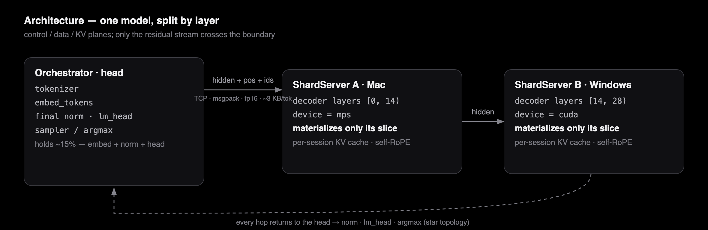
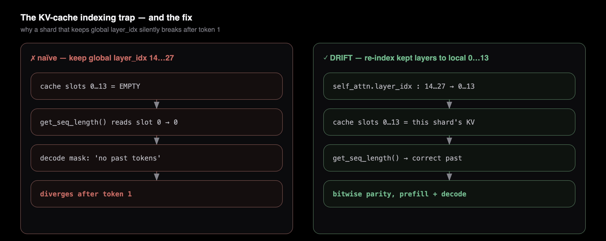
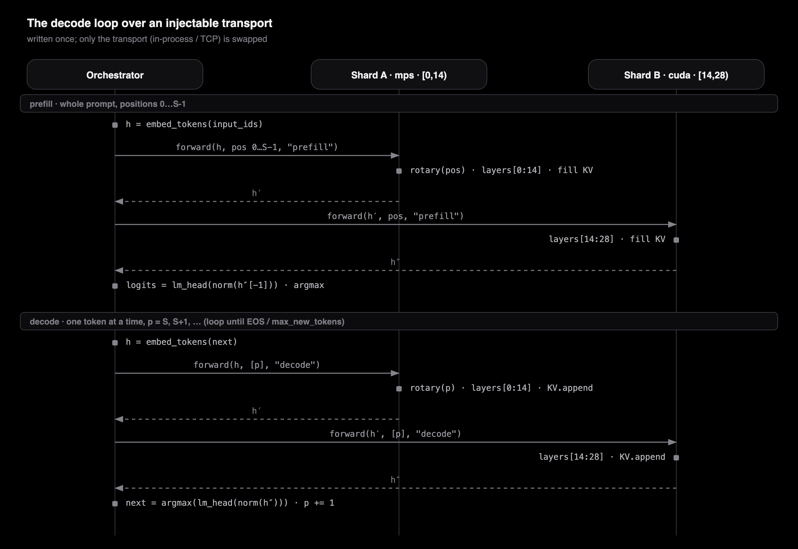
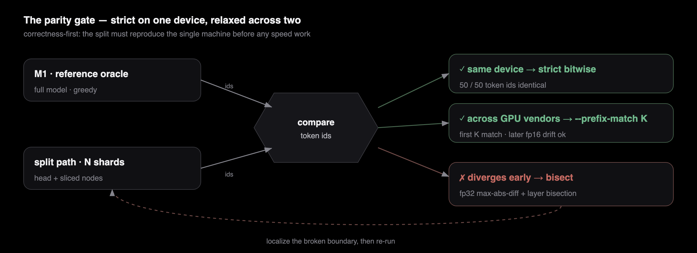

<h1 align="center">DRIFT</h1>

<p align="center"><b>Decentralized Routed Inference For Tokens — one model, split across your machines, no datacenter.</b></p>

<p align="center">
  <b>English</b> ·
  <a href="./README.ko.md">한국어</a> ·
  <a href="./README.zh.md">中文</a> ·
  <a href="./README.ja.md">日本語</a>
</p>

<p align="center">
  
  
  
  
  &nbsp;
  
  
  
  
  
  &nbsp;
  
  
  
  
  
  
</p>

**DRIFT** runs **one** large language model across **heterogeneous personal machines** — a Mac (Apple GPU, PyTorch **MPS**) and a Windows PC (NVIDIA GPU, PyTorch **CUDA**) — by splitting the model **layer by layer** (pipeline parallelism) and streaming only the **hidden state** between nodes over a **framework-neutral byte protocol** (TCP + msgpack). No datacenter, no `torch.distributed`, no NCCL, no vendor lock. The data plane is bound to *no* framework, so runtimes that could never talk to each other — an Apple Metal graph and an NVIDIA CUDA graph — now run one model together, and the output is **bit-for-bit identical** to running the whole model on a single machine.

**The differentiator in one line:** [Exo](https://github.com/exo-explore/exo) binds node-to-node communication to MLX (`mx.distributed`), so it is *Apple-silicon-to-Apple-silicon only* (Windows is "Longer term" on its roadmap). DRIFT lifts the boundary into a **neutral wire protocol** — *different runtimes, different GPU vendors, one model* — and proves the split is exact with a **bitwise parity gate.** A data plane bound to no framework is the core contribution.

**Scale.** One node per decoder layer — split one model across up to **28** machines on the default Qwen (**35** on Gemma), streaming across all of them. Two to four is today's sweet spot.

> *"The transcript is the model's output. The interesting part is **where** the computation actually ran — and that it added up, bit for bit."*

[**taewoopark.com** — author site](https://taewoopark.com)

---

## Table of contents

- [Why this is different](#why-this-is-different) — the comparison table engineers came for
- [What is DRIFT](#what-is-drift) — the name, the vision, the scope
- [Architecture](#architecture) — control / data / KV planes
- [The wire contract](#the-wire-contract-what-actually-crosses-the-boundary) — schema + bytes-per-token
- [Three correctness problems](#three-problems-a-correct-split-must-solve) — KV re-index, RoPE, mask
- [The decode loop](#the-decode-loop--injectable-transport) — sequence + injectable transport
- [Correctness & parity](#correctness--the-parity-gate) — the bitwise gate + measured results
- [Benchmarks](#benchmarks) — fidelity 100% · ≤ 42% of the model per node (measured) · protocol overhead ≈ 1 ms/hop
- [Model-agnostic by introspection](#model-agnostic-by-introspection) — Qwen, Gemma 4, and no hardcoding
- [Design rationale (why-not)](#design-rationale-why-not) — the decisions and their reasons
- [Milestones](#milestones) · [Quickstart](#quickstart) · [Repo map](#repository-map--where-to-look) · [FAQ](#faq) · [Roadmap](#roadmap)

---

## Why this is different

The whole point of DRIFT lives at the **boundary between nodes.** Here is how that boundary compares to the prior art:

| | **DRIFT** | Exo | Petals | llama.cpp RPC | vLLM / Megatron PP |
|---|---|---|---|---|---|
| **Split unit** | decoder layers | layers | transformer blocks | layers / tensors | layers (stages) |
| **Node↔node transport** | **TCP + msgpack** | MLX `mx.distributed` | gRPC (torch tensors) | custom RPC (ggml) | `torch.distributed` + NCCL |
| **Boundary payload** | **raw fp16 bytes + ints** | MLX arrays | torch objects | ggml tensors | torch tensors / NCCL bufs |
| **Framework-neutral wire** | **✅ yes** | ❌ MLX-bound | ❌ torch-bound | ggml-bound | ❌ torch/NCCL-bound |
| **Heterogeneous GPU vendors** | **✅ MPS + CUDA at once** | ❌ Apple only | partial | ✅ (ggml backends) | ❌ NCCL can't bridge |
| **Mac + Windows together** | **✅** | ❌ ("Longer term") | ~ | ✅ | ❌ |
| **Engine swappable behind an interface** | **✅ `ShardEngine` ABC** | ❌ | ❌ | n/a | ❌ |
| **KV cache location** | per-shard, local | per-shard | per-block | per-node | per-stage |
| **What crosses per token** | **~3 KB (hidden only)** | activations | activations | activations | activations |
| **Correctness contract** | **bitwise parity vs 1-machine** | — | — | — | — |

Read the table top-to-bottom and the thesis falls out: **everyone passes activations; only DRIFT makes the passing framework-neutral *and* proves the result is bitwise-exact.** NCCL cannot put an Apple GPU and an NVIDIA GPU in the same process group. MLX cannot leave the Apple ecosystem. DRIFT's answer is to make the wire carry *nothing but bytes* — no torch object, no MLX array, no CUDA handle — so the two worlds meet at a contract they can both implement.

---

## What is DRIFT

A server-less, peer-to-peer inference network: heterogeneous personal devices split **one** model by layer and run it **together.** Instead of routing through a hyperscaler's datacenter, *your machine and someone else's* converge to run a single AI.

The name is the system:

| letter | meaning |
|---|---|
| **D** — Decentralized | no single controller, no single point of failure; heterogeneous devices join as equal P2P nodes |
| **R** — Routed | an orchestrator *routes* hidden state through the nodes to carry inference forward |
| **I** — Inference | the workload is LLM inference (extensible to training) |
| **For T** — For Tokens | the double meaning of "token": the **inference** token (the atom of machine thought) **and** the **value** token (earned by contributing, spent on inference) — DRIFT's vision is to make the unit of thought and the unit of value one |

> **Scope of this repository.** This is the working demo of the **D·R·I** slice — *heterogeneous split inference.* The **"For Tokens"** economic layer (trustless verification, a token economy, global P2P discovery) is the vision and **future work**, deliberately out of scope here. What ships today is the hard technical core: *does a model split across a Mac and a Windows box actually produce the right answer?* — and the answer is yes, provably.

---

## Architecture

<p align="center"></p>

DRIFT separates cleanly into three planes:

- **Control plane** — the orchestrator calls shards in a fixed configured order. No discovery service, no leader election; the address list lives in `config.yaml`. (Discovery is a "For Tokens" concern, out of scope.)
- **Data plane** — the only things that cross a stage boundary are `hidden_states` (floats) and `position_ids` + `input_ids` (ints). Framework-agnostic, and — crucially — **its size depends on `hidden_size`, not on the parameter count.** A 1.5 B model and a 70 B model push the same ~3 KB/token if `hidden_size` matches.
- **KV cache plane** — each shard keeps the KV for *its own* layer range, per session, on its own device. **The cache never crosses the wire** (that would be megabytes/token and would defeat the whole design). Only the residual stream travels.

---

## The wire contract (what actually crosses the boundary)

The contract (`drift/protocol.py`) is **frozen**: every message is a **4-byte big-endian length prefix + a msgpack dict.** Any future runtime — MLX, ggml, JAX, a Rust node — only has to implement this framing to join the pipeline. There is no PyTorch on the wire.

```jsonc
// request  (orchestrator → shard)
{
  "type":         "prefill" | "decode" | "reset" | "ping",
  "session_id":   "s0",               // one generation sequence
  "seq_id":       42,                 // monotonic, for ordering / debug
  "shape":        [1, 1, 1536],       // hidden_states shape (decode: S=1)
  "dtype":        "float16",
  "position_ids": [37],               // absolute positions  → RoPE, computed on-shard
  "input_ids":    [785],              // token ids → per-layer embeddings (PLE, Gemma 4)
  "tensor":       "<raw fp16 bytes>"  // row-major hidden_states
}

// response (shard → orchestrator)
{ "ok": true, "shape": [1,1,1536], "dtype": "float16", "tensor": "<bytes>", "error": null }

// ping response  →  { "ok": true, "name", "start_layer", "end_layer", "device" }
```

**Bytes per token.** During decode the activation is `[1, 1, hidden]` in fp16 = `hidden × 2` bytes. For Qwen's `hidden = 1536` that is **3 072 bytes ≈ 3 KB**, plus one `position_id`, one `input_id`, and a few bytes of msgpack framing. A two-shard pipeline does ~4 such crossings per token (orchestrator→A, A→orchestrator, orchestrator→B, B→orchestrator) ≈ **12 KB/token of wire traffic** — on a LAN, trivial next to the compute.

**Why these three fields, and only these:**

- `hidden_states` — the residual stream; the one thing a downstream layer genuinely needs.
- `position_ids` — so each shard computes its **own** RoPE from absolute positions (see below). Sending positions instead of precomputed `cos/sin` keeps the payload tiny and the node self-sufficient.
- `input_ids` — reserved from **M0** so **Per-Layer-Embedding** models (Gemma 4) work without ever re-freezing the contract: a downstream shard reconstructs its per-layer embedding signal locally from token ids. Plain models (Qwen) simply ignore it.

**Why fp16 on the wire is safe.** Serialization is a CPU fp16 round-trip: `tensor.detach().to("cpu", float16).contiguous().numpy().tobytes()` on the way out, `np.frombuffer(buf, np.float16).reshape(shape).copy()` on the way back. If the compute dtype is already fp16, that round-trip is **bit-lossless** — which is the premise that lets the split path reproduce a single machine *exactly*, not approximately.

---

## Three problems a correct split must solve

Splitting layers across processes sounds trivial until you try to make the output *identical* to the unsplit model. Three things bite, and DRIFT handles each explicitly. These are where the real engineering is — and what a reviewer should scrutinize.

### 1 · KV cache indexing — the subtle one

Hugging Face's `DynamicCache` is indexed by a layer's `layer_idx`, and it reports "past length" from **layer 0's** slot. A shard that keeps global layers `[14, 28)` and naïvely reuses their global indices leaves cache slot 0 **empty** — so during decode the causal mask is built as if there were *no past*, and parity silently breaks after the very first token.

<p align="center"></p>

DRIFT re-indexes each shard's kept layers to **local, 0-based** cache slots at load time, and sizes the per-session `DynamicCache` to the shard's local layer count. In-process, two shards can share one loaded model because they own **disjoint** layer objects — re-indexing one never touches the other.

### 2 · RoPE self-computation — keep the wire tiny

Rotary position embeddings depend only on `position_ids`, not on which layer consumes them. So each shard computes its own `cos/sin` from **absolute** positions via the model's own `rotary_emb` module — a shard holding layers `[14, 28)` still gets it right. The boundary therefore carries a handful of integers instead of a full `[S, head_dim]` `cos/sin` tensor, and every node stays self-sufficient.

### 3 · Attention mask per stage

For prefill the mask is causal-full; for decode it is KV-length-aware. DRIFT rebuilds the mask on each shard with the installed Transformers masking utilities (`create_causal_mask`, and `create_sliding_window_causal_mask` for models like Gemma that alternate local/global attention per layer). The mask is chosen **per layer** by the layer's own attention type — nothing hardcoded.

---

## The decode loop & injectable transport

<p align="center"></p>

The loop routes through an **injectable transport** with a single signature — `transport(shard, session, hidden, position_ids, input_ids, mode)`. The decode loop is written **once**; only the transport is swapped:

| Transport | Milestone | Boundary | Purpose |
|---|---|---|---|
| **in-process callable** | M2 | direct `engine.forward(...)`, no socket | prove the split logic in isolation |
| **socket client** | M3+ | the §6 protocol over TCP | prove serialization / framing |

Because the loop is identical, the **network is the only variable between M2 and M3** — so any M3 regression is *provably* a serialization bug, never a logic bug. This is the single most important structural decision in the codebase.

---

## Correctness — the parity gate

DRIFT is **correctness-first**: every networked step must reproduce the single-machine reference **bitwise** before any performance work. Speed is not the point of the demo — *heterogeneous split inference being exact* is.

<p align="center"></p>

**Measured results** — Qwen2.5-1.5B-Instruct, Apple MPS, fp16:

| Gate | What it isolates | Result |
|---|---|---|
| **M0** ping | neutral protocol reachability | ✅ both shards reply |
| **M2** in-process 2-shard | sharding · RoPE · KV · mask | ✅ **50 / 50 token ids bitwise == reference** |
| **M3** TCP 2-process | serialization / framing | ✅ **50 / 50 bitwise == reference** |
| **`--selftest`** (6 prompts) | overfitting to one prompt | ✅ **6 / 6 bitwise** — English · code · Korean; `n = 1, 40, 50, 60, 80, 180` |

The `--selftest` is the strongest evidence: it re-derives a fresh reference and compares, across prompt *kinds* (prose, source code, Korean) and *lengths* (a single-token generation up to a 180-token decode). Every token id matches — first divergence index `None` in all six.

**MPS ↔ CUDA (M4).** Only at the true cross-machine step do the two GPU vendors' kernels round fp16 differently, so greedy decoding may diverge in *later* tokens — this is expected, and handled by a **relaxed gate**: `python -m drift.parity_test --prefix-match K` requires the first K ids to match and allows the drift after them. Divergence at token 1–2 is a **bug**, not float noise → bisect.

---

## Benchmarks

*Methodology, controls, and the fair competitor protocol: **[docs/benchmarks.md](docs/benchmarks.md)**. Reproduce every number with `python -m drift.bench`.*

`tokens/sec` is the wrong axis to lead with: on an Apple-only cluster Exo's native MLX path wins raw throughput, and on the axis DRIFT owns — Mac(MPS)↔Windows(CUDA) — no competitor even runs ([see the table](#why-this-is-different)). So the numbers live where a *correct* split genuinely leads, all on **one** Mac — Qwen2.5-1.5B-Instruct · fp16 · Apple MPS.

**Fidelity — does splitting change the output?** *(split path vs the single-machine oracle, greedy)*

| Metric | Result |
|---|---|
| token exact-match — 6 prompts, `n = 1…180` | **411 / 411 = 100.00 %** |
| cases bitwise-identical | **6 / 6** |
| first-step logit max-abs-diff (fp32) | 7.81 × 10⁻³ *(fp16 ULP)* |
| KL divergence (nats) | ≤ 2.82 × 10⁻¹⁰ |

Token ids are **bitwise-identical** to a single machine; the logits agree to the fp16 ULP and the argmax is invariant under that noise. No other tool in this space measures — let alone guarantees — this. *This is DRIFT's monopoly axis.*

**Footprint — no single node holds the whole model**

| Node | Holds | fp16 | % of full |
|---|---|---:|---:|
| orchestrator | embed + norm + lm_head | 0.47 GB | 15.1 % |
| shard · mac | decoder layers [0, 14) | 1.31 GB | 42.4 % |
| shard · windows | decoder layers [14, 28) | 1.31 GB | 42.4 % |
| **full model** | — | **3.09 GB** | 100 % |

The heaviest single node carries **42.4 %** of the model — one 2× too big for either machine alone runs across the pair. This is the reason pipeline splitting exists. **These are measured on-device allocations, not just each node's compute share:** every node materializes only its slice (`init_empty_weights` + a selective safetensors read), so the whole model is never resident on any one machine — and the parity gate proves the sliced load stays bit-for-bit identical to a single-machine load.

**The neutral wire is thin, and nearly free**

| Metric | Value |
|---|---|
| on the wire per token per hop | **3.10 KB** — only the fp16 hidden state |
| weights : per-token wire | **≈ 970,000 ×** |
| TPOT — in-process (M2) → TCP (M3) | 40.7 → 43.1 ms/token |
| protocol overhead | **+2.45 ms/token** (~1.2 ms/hop, ~6 % of TPOT) |

The **same decode loop** runs over both transports, so the M3 − M2 delta is the *pure* cost of the framework-neutral protocol — the thing that lets MPS and CUDA cooperate. At localhost it is a small per-hop round-trip (~1.2 ms/hop), dwarfed by the ~41 ms/token of compute; it is noisy enough at this scale to straddle zero run-to-run (an earlier run measured it slightly *negative*). (A real LAN adds RTT on top, unchanged by DRIFT.)

> Absolute, reproducible numbers — not a cherry-picked win. A head-to-head `tok/s` against Exo / llama.cpp RPC needs them installed on the same box; the honest protocol for that is in **[docs/benchmarks.md](docs/benchmarks.md)**. Today's comparative claim is the capability matrix above **plus** a distributed output that is *provably* identical to one machine.

---

## Model-agnostic by introspection

The engine never hardcodes a model architecture. At load it **introspects** the loaded model and adapts:

```python
# drift/engine_torch.py — the loaded model is the source of truth, not a fixed class
layer_cls   = type(self.layers[0])                       # Qwen2DecoderLayer / Gemma4DecoderLayer / …
self._layer_params = set(inspect.signature(layer_cls.forward).parameters)
self.rotary       = self.inner.rotary_emb                # self-computed RoPE, any model
self.has_sliding  = getattr(self.inner, "has_sliding_layers", False)
self.layer_types  = [cfg.layer_types[i] for i in range(start, end)]   # per-layer attention type
# … at call time, pass only the kwargs this version's layer actually accepts:
call_kwargs = {k: v for k, v in call_kwargs.items() if k in self._layer_params}
```

That is why two very different families drop into the *same* engine:

| Model | Layers → split | Gated | Architectural quirks DRIFT handles (introspected, never hardcoded) |
|---|---|---|---|
| **Qwen/Qwen2.5-1.5B-Instruct** *(primary)* | 28 → `0–14 / 14–28` | no | plain decoder, single RoPE θ, `DynamicCache`, tied `lm_head` — the correctness baseline |
| **google/gemma-4-E2B-it** *(secondary)* | 35 → `0–18 / 18–35` | no (Apache-2.0) | **Per-Layer Embeddings** (shard self-computes from `input_ids`) · sqrt(hidden) embed scaling (orchestrator) · **dual RoPE θ** local/global · **hybrid** per-layer sliding/global attention · `HybridCache` + KV-sharing groups · no final-logit softcap; needs `transformers ≥ 5.5` |

Each Gemma 4 quirk maps cleanly onto a plane — **orchestrator** (embed scaling), **shard** (dual-θ RoPE, hybrid mask, hybrid cache), or the **wire** (`input_ids` for PLE) — and every one is discovered from `config`/signature at load, so the code that runs Qwen runs Gemma 4 unchanged. That is the model-agnostic payoff of the same principle the neutral wire embodies: *depend on what you can observe, hardcode nothing.*

---

## Design rationale (why-not)

The interesting decisions are the ones DRIFT declined. Each is a deliberate, hard constraint.

- **Why not `torch.distributed` / NCCL / gloo across nodes?** NCCL cannot place an Apple Metal device and an NVIDIA CUDA device in one process group — full stop. And any of these couples the *data plane* to a specific backend, which is exactly what DRIFT refuses. The wire is neutral bytes so the runtimes need agree on nothing but framing.
- **Why not ship the KV cache between nodes?** KV is megabytes per token and grows with sequence length; sending it would dwarf the ~3 KB residual and destroy the economics. Each shard keeps its own KV locally; only the residual stream travels.
- **Why fp16 on the wire (not fp32)?** With fp16 compute, the CPU fp16 round-trip is bit-lossless, so serialization can't perturb parity — while halving wire bytes vs fp32. (fp16 compute lives on the GPU where it's fast; CPU fp16 kernels are unreliable, which is why the parity baseline runs on MPS, not CPU.)
- **Why sequential, single-session first?** Concurrency, batching, and speculative decoding are optimizations. The demo's value is *correctness under heterogeneity*, so they are deferred until parity is proven — and it is.
- **Why not keep the whole model on every node?** Each node materializes **only its slice** — `init_empty_weights` builds the skeleton on the meta device, then only the tensors that node actually runs (its decoder layers, or the head's `embed`/`norm`/`lm_head`) are read from the safetensors and placed on the device. The heaviest node holds **42 % of the weights in real memory**, and the parity gate proves the sliced load is bitwise-identical to a single-machine load.
- **Why freeze the wire contract at M0?** So node internals can change forever without a flag day. The `input_ids` field was added *before* freezing precisely so PLE models (Gemma 4) never force a breaking change.

---

## Milestones

| # | Milestone | Needs | Status |
|---|---|---|---|
| **M0** | env + neutral protocol framing (ping) | Mac | ✅ done |
| **M1** | single-machine reference oracle | Mac | ✅ done |
| **M2** | in-process 2-shard parity (no network) | Mac | ✅ **bitwise** |
| **M3** | localhost 2-process parity (TCP) | Mac | ✅ **bitwise** |
| **M4** | cross-machine — Mac MPS + Windows CUDA | + Windows | ⬜ needs 2nd node |
| **M5** | booth display + interactive streaming | + Windows | ⬜ |
| **M6** | graceful kill-node recovery | + Windows | ⬜ |

The Mac-only track (M0–M3) is ~80 % of the engineering and **100 % of the correctness risk** — done and reviewed. M4–M6 only add the second machine and the show.

---

## Quickstart

Requires Python **3.12** and [`uv`](https://github.com/astral-sh/uv). Both default models are **ungated** — no Hugging Face login. Everything below is the real `drift` CLI.

**1 · Install** — on each machine:

```bash
git clone https://github.com/TaewoooPark/DRIFT && cd DRIFT
bash scripts/install.sh          # macOS / Linux   ·   Windows: powershell -File scripts\install.ps1
drift doctor                     # checks Python, torch, device, config, ports
```

**2 · Try it on one machine:**

```bash
drift up 2                       # 2 local nodes, auto-split the model, open a chat
                                 # (add --prompt "…" for a one-shot answer)
```

**3 · Run one model across your Mac + a CUDA PC** — the real thing.

The **head** types the prompt and holds `embed`/`lm_head`; the decoder layers live on the **nodes**. To use *both* GPUs, the Mac runs a node **and** the head; the PC runs a node:

```bash
# Windows PC (NVIDIA)          — one terminal
drift node --port 52601        # device = cuda, announced on the LAN

# Mac (Apple)                  — terminal 1: a worker
drift node --port 52600        # device = mps

# Mac                          — terminal 2: the head (type the prompt)
drift run --prompt "hello world"
```

```text
  node : 127.0.0.1:52600     layers [0:14)   · device=mps      ← the Mac computes these
  node : 192.168.0.22:52601  layers [14:28)  · device=cuda     ← the PC computes these

  Hello! How can I help you today?
```

Two Macs or two Windows PCs run with the **same three commands** — devices auto-detect, `drift run` finds and splits. If Wi-Fi blocks mDNS, name the nodes: `drift run --nodes 192.168.0.22:52601,127.0.0.1:52600 --prompt "hello world"`. Across GPU vendors (MPS↔CUDA) fp16 rounds a little differently, so long answers may drift in later tokens — expected, not a bug.

**Customize & fine-tune** — models, split points, devices, driving the shards by hand, and troubleshooting — is all in the **operations manual → [docs/manual.md](docs/manual.md)** ([한국어](docs/manual.ko.md) · [中文](docs/manual.zh.md) · [日本語](docs/manual.ja.md)).

---

## Repository map — where to look

```text
drift/
  protocol.py       # THE CONTRACT — 4B length prefix + msgpack; fp16 tensor ser/deser
  engine_base.py    # ShardEngine ABC — the swappable-runtime seam
  engine_torch.py   # PyTorch shard: introspected layer calls, local KV re-index, self-RoPE  ← the crux
  shard_server.py   # TCP server: ping / reset / prefill / decode
  orchestrator.py   # embed + norm + lm_head + sampler; injectable transport; decode loop
  reference.py      # M1 single-machine oracle
  parity_test.py    # M2/M3 gate + multi-prompt --selftest
  common.py         # config + identical tokenization (shared by oracle and split path)
config.yaml         # model, dtype, port, shard table
docs/               # public docs — benchmarks.md (methodology + results) · manual.md (how to run it)
```

**Reviewer's shortlist:** `engine_torch.py` (the KV re-index + introspection), `protocol.py` (the frozen wire), `orchestrator.py` (the injectable transport + decode loop).

---

## FAQ

**Is this just pipeline parallelism?** The *idea* is, but the contribution is the **boundary**: PP in vLLM/Megatron is welded to `torch.distributed`+NCCL and can't bridge MPS↔CUDA. DRIFT's boundary is neutral bytes, so heterogeneous vendors join — and it's proven bitwise-exact.

**Does the network see my tokens?** Only integer `input_ids` and float `hidden_states` cross the wire — no text, no KV. On a LAN this stays on your machines. (Encryption/trust is a "For Tokens" concern, out of scope here.)

**Can I add a third node?** Yes — the split is a list of layer ranges in `config.yaml`; add a shard entry and the orchestrator routes through it in order. The wire contract doesn't change.

**Why is the reference on MPS, not CPU?** Because the compute dtype is fp16 and CPU fp16 kernels in PyTorch are unreliable; MPS runs fp16 correctly and deterministically, so M1–M3 are all on MPS and match bitwise. CPU/CUDA are configurable.

**What about batching / throughput?** Deferred by design (correctness-first). Sequential single-session is enough to prove the split is exact; batching is future work.

**Why Qwen and Gemma 4 specifically?** Both are ungated (no license wall) and cover two ends of the architecture space — a plain decoder and one with Per-Layer Embeddings + hybrid attention — which stress-tests the "introspect, don't hardcode" engine.

---

## Roadmap

- **M4 — cross-machine.** Mac (MPS) + Windows (CUDA) on one model over the LAN. The relaxed parity gate (`--prefix-match K`) absorbs the expected MPS↔CUDA float divergence, and nodes cross-check version / byte-order at ping before layers are assigned — the physical second machine is what's left.
- **M5 — booth display.** Each node shows its live layer range + device; the orchestrator streams tokens as *"front half thought by Apple GPU, back half by NVIDIA."*
- **M6 — graceful kill-node.** Detect a dropped shard mid-decode → notify → reconfigure/restart (no seamless failover — that needs replication).
- **v2 — engine swap.** An `engine_mlx.py` behind the same `ShardEngine` interface — the wire stays frozen; only the node internals change. This is where the framework-neutral thesis pays off: an MLX shard and a CUDA shard, one model.

---

## Contact

<p align="center">
  <a href="https://github.com/TaewoooPark"></a>
  <a href="https://x.com/theoverstrcture"></a>
  <a href="https://www.linkedin.com/in/taewoo-park-427a05352"></a>
  <a href="https://www.instagram.com/t.wo0_x/"></a>
  <a href="https://taewoopark.com"></a>
  <a href="mailto:ptw151125@kaist.ac.kr"></a>
</p>

<p align="center"><sub>No datacenter. No torch.distributed. Your machine and someone else's, running one mind — and it adds up, bit for bit.</sub></p>
