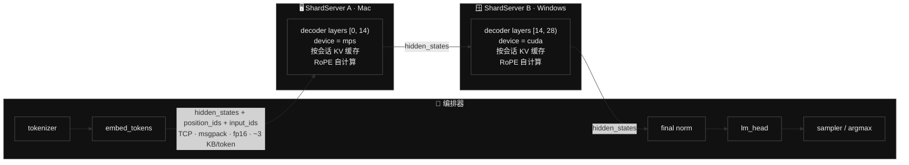
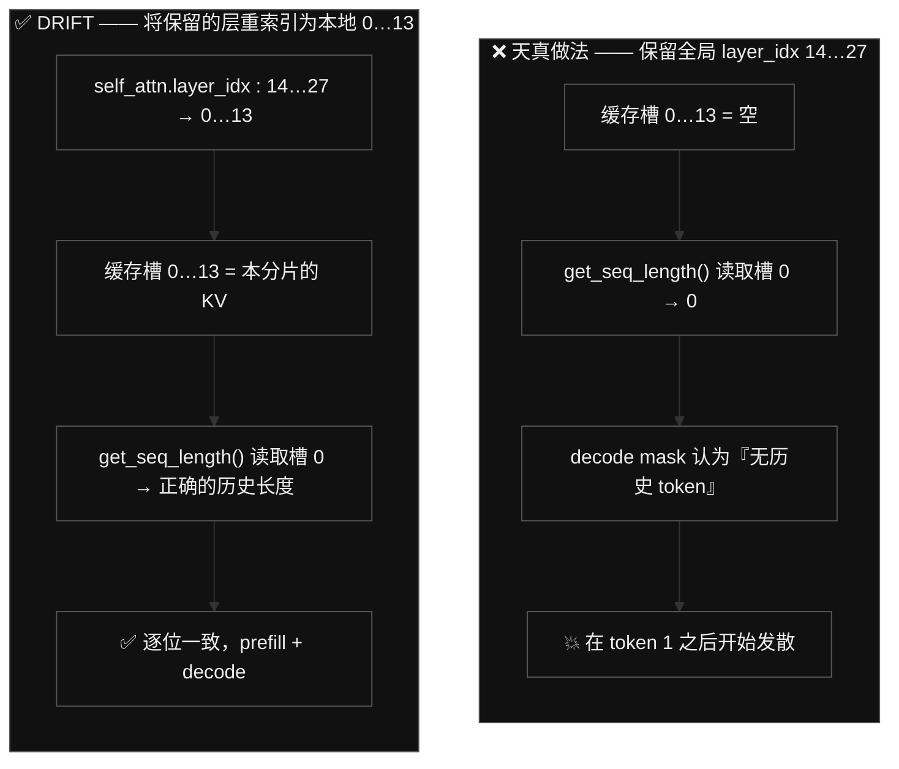
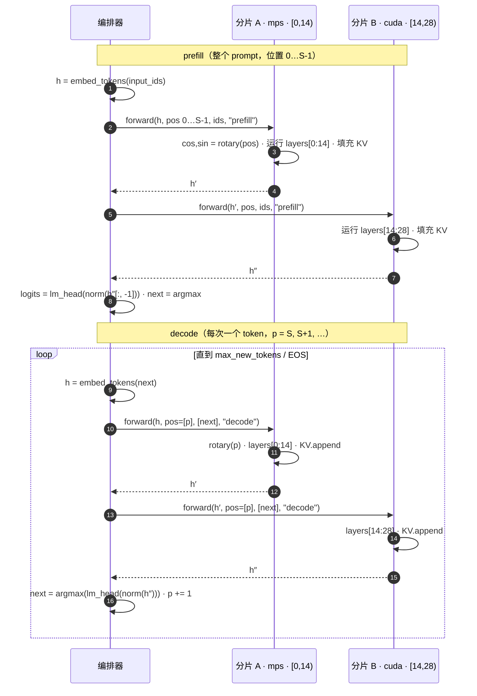
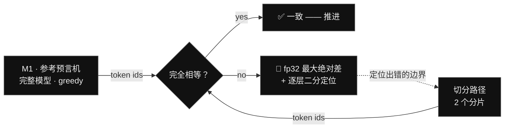

<h1 align="center">DRIFT</h1>

<p align="center"><b>Decentralized Routed Inference For Tokens —— 一个模型，拆分到你自己的多台机器上运行，无需数据中心。</b></p>

<p align="center">
  <a href="./README.md">English</a> ·
  <a href="./README.ko.md">한국어</a> ·
  <b>中文</b> ·
  <a href="./README.ja.md">日本語</a>
</p>

<p align="center">
  
  
  
  
  &nbsp;
  
  
  
  
  
  &nbsp;
  
  
  
  
  
  
</p>

**DRIFT** 让**一个**大语言模型跨**异构个人设备**运行——一台 Mac（Apple GPU，PyTorch **MPS**）和一台 Windows PC（NVIDIA GPU，PyTorch **CUDA**）——做法是把模型**逐层切分**（pipeline parallelism），并只在节点之间通过一套**框架中立的字节协议**（TCP + msgpack）流式传输 **hidden state**。没有数据中心，没有 `torch.distributed`，没有 NCCL，没有厂商锁定。数据平面*不绑定任何*框架，于是那些本来永远无法对话的运行时——一张 Apple Metal 计算图和一张 NVIDIA CUDA 计算图——如今得以共同运行一个模型，而其输出与在单机上运行整个模型**逐位（bit-for-bit）完全相同**。

**一句话讲清差异：** [Exo](https://github.com/exo-explore/exo) 把节点间通信绑定在 MLX（`mx.distributed`）上，因此只能*在 Apple 芯片之间*工作（Windows 在其路线图上还是 "Longer term"）。DRIFT 把这条边界抬升为一套**中立的线缆协议**——*不同的运行时、不同的 GPU 厂商、同一个模型*——并用一道**逐位一致性门禁（bitwise parity gate）**证明这种切分是精确的。一个不绑定任何框架的数据平面，正是核心贡献。

**扩展。** 每个解码器层一个节点——默认 Qwen 最多可跨 **28** 台机器（Gemma 为 **35** 台）流式运行同一个模型。就当前模型而言，**2–4** 台是最佳区间。

> *"这段对话记录就是模型的输出。有意思的地方在于这段计算实际上**在哪里**运行——以及它最终逐位地、分毫不差地对上了账。"*

[**taewoopark.com** —— 作者主页](https://taewoopark.com)

---

## 目录

- [为何与众不同](#为何与众不同) —— 工程师们冲着来看的那张对比表
- [什么是 DRIFT](#什么是-drift) —— 名字、愿景与范围
- [架构](#架构) —— 控制平面 / 数据平面 / KV 平面
- [线缆契约](#线缆契约真正跨越边界的东西) —— schema + 每 token 字节数
- [三个正确性问题](#正确的切分必须解决的三个问题) —— KV 重索引、RoPE、mask
- [解码循环](#解码循环与可注入传输层) —— 时序图 + 可注入传输层
- [正确性与一致性](#正确性一致性门禁) —— 逐位门禁 + 实测结果
- [基准测试](#基准测试) —— fidelity 100% · 每节点 ≤ 42% 模型 · 协议开销 ≈ 0
- [通过自省实现模型无关](#通过自省实现模型无关) —— Qwen、Gemma 4，以及零硬编码
- [设计取舍（为何不）](#设计取舍为何不) —— 那些决定及其理由
- [里程碑](#里程碑) · [快速开始](#快速开始) · [仓库地图](#仓库地图该看哪里) · [常见问题](#常见问题) · [路线图](#路线图)

---

## 为何与众不同

DRIFT 的全部要点都落在**节点之间的边界**上。下面把这条边界与已有工作做个对比：

| | **DRIFT** | Exo | Petals | llama.cpp RPC | vLLM / Megatron PP |
|---|---|---|---|---|---|
| **切分单元** | decoder 层 | 层 | transformer 块 | 层 / 张量 | 层（stage） |
| **节点↔节点传输** | **TCP + msgpack** | MLX `mx.distributed` | gRPC（torch 张量） | 自定义 RPC（ggml） | `torch.distributed` + NCCL |
| **边界载荷** | **裸 fp16 字节 + 整数** | MLX 数组 | torch 对象 | ggml 张量 | torch 张量 / NCCL 缓冲区 |
| **框架中立的线缆** | **✅ 是** | ❌ 绑定 MLX | ❌ 绑定 torch | 绑定 ggml | ❌ 绑定 torch/NCCL |
| **异构 GPU 厂商** | **✅ MPS + CUDA 同时** | ❌ 仅 Apple | 部分 | ✅（ggml 后端） | ❌ NCCL 无法桥接 |
| **Mac + Windows 共存** | **✅** | ❌（"Longer term"） | ~ | ✅ | ❌ |
| **引擎可在接口后替换** | **✅ `ShardEngine` ABC** | ❌ | ❌ | 不适用 | ❌ |
| **KV 缓存位置** | 按分片，本地 | 按分片 | 按块 | 按节点 | 按 stage |
| **每 token 跨越边界的量** | **~3 KB（仅 hidden）** | activation | activation | activation | activation |
| **正确性契约** | **对比单机的逐位一致** | — | — | — | — |

从上到下读完这张表，论点自然浮现：**所有人都在传递 activation；唯有 DRIFT 让这种传递做到框架中立，*并且*证明结果是逐位精确的。** NCCL 无法把一块 Apple GPU 和一块 NVIDIA GPU 放进同一个进程组，MLX 走不出 Apple 生态。DRIFT 的答案是让线缆*只承载字节*——没有 torch 对象、没有 MLX 数组、没有 CUDA 句柄——于是两个世界在一份双方都能实现的契约上相遇。

---

## 什么是 DRIFT

一个无服务器、点对点的推理网络：异构个人设备按层切分**同一个**模型并**协同**运行。不再经由超大规模云厂商的数据中心中转，而是*你的机器和别人的机器*汇聚起来，共同运行同一个 AI。

这个名字本身就是这套系统：

| 字母 | 含义 |
|---|---|
| **D** —— Decentralized（去中心化） | 没有单一控制者，没有单点故障；异构设备作为对等的 P2P 节点加入 |
| **R** —— Routed（路由） | 由编排器把 hidden state *路由*穿过各节点，推动推理向前 |
| **I** —— Inference（推理） | 工作负载是 LLM 推理（可扩展到训练） |
| **For T** —— For Tokens（为了 token） | "token" 的双重含义：**推理** token（机器思维的原子）**以及**价值 token（靠贡献赚取、用于支付推理）——DRIFT 的愿景是让思维的单位与价值的单位合而为一 |

> **本仓库的范围。** 这是 **D·R·I** 这一部分的可运行演示——*异构切分推理*。**"For Tokens"** 经济层（无信任验证、token 经济、全球 P2P 发现）是愿景与**未来工作**，在此有意排除在范围之外。今天交付的是最硬核的技术核心：*一个跨 Mac 与 Windows 切分的模型，究竟能不能给出正确答案？*——答案是肯定的，而且可证明。

---

## 架构



DRIFT 干净地分成三个平面：

- **控制平面**——编排器按配置好的固定顺序调用各分片。没有发现服务，没有 leader 选举；地址列表就放在 `config.yaml` 里。（服务发现属于 "For Tokens" 的范畴，不在此范围内。）
- **数据平面**——跨越 stage 边界的只有 `hidden_states`（浮点）以及 `position_ids` + `input_ids`（整数）。与框架无关，而且——关键在于——**它的大小取决于 `hidden_size`，而非参数量。** 只要 `hidden_size` 相同，一个 1.5 B 模型和一个 70 B 模型每 token 推送的都是同样的 ~3 KB。
- **KV 缓存平面**——每个分片按会话、在自己的设备上保存*属于自己*那段层范围的 KV。**缓存永远不跨越线缆**（否则将是每 token 数 MB，会彻底葬送整个设计）。只有残差流（residual stream）在传输。

---

## 线缆契约（真正跨越边界的东西）

这份契约（`drift/protocol.py`）是**冻结不变的**：每条消息都是**一个 4 字节大端长度前缀 + 一个 msgpack dict**。任何未来的运行时——MLX、ggml、JAX、一个 Rust 节点——只需实现这套帧格式就能加入流水线。线缆上没有任何 PyTorch。

```jsonc
// 请求（编排器 → 分片）
{
  "type":         "prefill" | "decode" | "reset" | "ping",
  "session_id":   "s0",               // 一个生成序列
  "seq_id":       42,                 // 单调递增，用于排序 / 调试
  "shape":        [1, 1, 1536],       // hidden_states 形状（decode 时 S=1）
  "dtype":        "float16",
  "position_ids": [37],               // 绝对位置 → RoPE，在分片上计算
  "input_ids":    [785],              // token id → 逐层嵌入（PLE，Gemma 4）
  "tensor":       "<raw fp16 bytes>"  // 行主序 hidden_states
}

// 响应（分片 → 编排器）
{ "ok": true, "shape": [1,1,1536], "dtype": "float16", "tensor": "<bytes>", "error": null }

// ping 响应  →  { "ok": true, "name", "start_layer", "end_layer", "device" }
```

**每 token 的字节数。** 在 decode 阶段，activation 是 fp16 的 `[1, 1, hidden]` = `hidden × 2` 字节。对 Qwen 的 `hidden = 1536` 来说，就是 **3 072 字节 ≈ 3 KB**，外加一个 `position_id`、一个 `input_id`，以及几个字节的 msgpack 帧开销。一条两分片流水线每 token 大约发生 4 次这样的跨越（编排器→A、A→编排器、编排器→B、B→编排器）≈ **每 token 12 KB 的线缆流量**——在局域网上，这相比计算量微不足道。

**为什么是这三个字段，且仅有这三个：**

- `hidden_states`——残差流；下游层真正需要的唯一东西。
- `position_ids`——让每个分片从**绝对**位置**各自**计算 RoPE（见下文）。传位置而非预先算好的 `cos/sin`，既让载荷保持极小，也让节点自给自足。
- `input_ids`——从 **M0** 起就预留，好让 **Per-Layer-Embedding** 模型（Gemma 4）无需重新冻结契约即可工作：下游分片从 token id 在本地重建它的逐层嵌入信号。普通模型（Qwen）直接忽略它。

**为什么线缆上用 fp16 是安全的。** 序列化是一次 CPU fp16 往返：出站时 `tensor.detach().to("cpu", float16).contiguous().numpy().tobytes()`，回来时 `np.frombuffer(buf, np.float16).reshape(shape).copy()`。如果计算 dtype 本就是 fp16，这次往返就是**位无损的**——正是这个前提，让切分路径能够*精确*复现单机结果，而非近似。

---

## 正确的切分必须解决的三个问题

把层切分到多个进程听起来微不足道，直到你试图让输出与未切分的模型*完全一致*。有三件事会咬人，DRIFT 逐一显式处理。真正的工程含量就在这里——也是审阅者应当仔细推敲之处。

### 1 · KV 缓存索引——最微妙的一个

Hugging Face 的 `DynamicCache` 以某层的 `layer_idx` 为索引，并且它从**第 0 层**的槽位来报告"历史长度（past length）"。一个保留全局层 `[14, 28)` 的分片，若天真地沿用这些全局索引，就会让缓存槽 0 **空着**——于是在 decode 时因果掩码（causal mask）会当作*没有历史*来构建，而一致性在第一个 token 之后就悄然崩坏。



DRIFT 在加载时把每个分片保留的层重索引为**本地、从 0 开始**的缓存槽，并把每会话的 `DynamicCache` 大小设为该分片的本地层数。在进程内，两个分片可以共享同一个已加载的模型，因为它们持有**互不相交**的层对象——重索引其中一个绝不会触碰另一个。

### 2 · RoPE 自计算——让线缆保持极小

旋转位置嵌入（Rotary position embeddings）只依赖 `position_ids`，而与哪一层消费它无关。因此每个分片都通过模型自带的 `rotary_emb` 模块，从**绝对**位置各自计算 `cos/sin`——一个持有层 `[14, 28)` 的分片照样能算对。于是边界上携带的是寥寥几个整数，而不是一整个 `[S, head_dim]` 的 `cos/sin` 张量，每个节点都保持自给自足。

### 3 · 每阶段的注意力掩码

prefill 时掩码是完整因果（causal-full）；decode 时它感知 KV 长度。DRIFT 在每个分片上用所安装的 Transformers 掩码工具重建掩码（`create_causal_mask`，以及针对像 Gemma 这种逐层交替 local/global attention 的模型的 `create_sliding_window_causal_mask`）。掩码是**逐层**根据该层自身的 attention 类型来选择的——没有任何硬编码。

---

## 解码循环与可注入传输层



这个循环通过一个**可注入的传输层**来路由，它只有唯一一个签名——`transport(shard, session, hidden, position_ids, input_ids, mode)`。解码循环只写**一次**；被替换的只有传输层：

| 传输层 | 里程碑 | 边界 | 目的 |
|---|---|---|---|
| **进程内可调用对象** | M2 | 直接 `engine.forward(...)`，无 socket | 隔离地验证切分逻辑 |
| **socket 客户端** | M3+ | TCP 之上的 §6 协议 | 验证序列化 / 帧格式 |

因为循环完全相同，**M2 与 M3 之间唯一的变量就是网络**——所以任何 M3 回归都*可证明地*是序列化 bug，而绝不会是逻辑 bug。这是整个代码库中最重要的一个结构性决定。

---

## 正确性——一致性门禁

DRIFT 是**正确性优先**的：在任何性能工作之前，每一个带网络的步骤都必须**逐位**复现单机参考结果。速度不是这个演示的重点——*异构切分推理做到精确*才是。



**实测结果**——Qwen2.5-1.5B-Instruct，Apple MPS，fp16：

| 门禁 | 隔离的对象 | 结果 |
|---|---|---|
| **M0** ping | 中立协议可达性 | ✅ 两个分片都回复 |
| **M2** 进程内 2 分片 | 切分 · RoPE · KV · mask | ✅ **50 / 50 token id 逐位 == 参考** |
| **M3** TCP 2 进程 | 序列化 / 帧格式 | ✅ **50 / 50 逐位 == 参考** |
| **`--selftest`**（6 个 prompt） | 对单一 prompt 过拟合 | ✅ **6 / 6 逐位** —— 英文 · 代码 · 韩文；`n = 1, 40, 50, 60, 80, 180` |

`--selftest` 是最有力的证据：它重新推导出一份全新的参考，并在不同 prompt *类型*（散文、源代码、韩文）与不同*长度*（从单 token 生成一直到 180 token 的 decode）上进行比较。每一个 token id 都吻合——六个用例的首个分歧下标全部为 `None`。

**MPS ↔ CUDA（M4）。** 只有到了真正的跨机步骤，两家 GPU 厂商的 kernel 才会对 fp16 做出不同的舍入，于是贪心解码可能在*较靠后*的 token 上发散——这是预期之内的，由一道**放宽的门禁**处理：`python -m drift.parity_test --prefix-match K` 要求前 K 个 token 吻合，允许其后的发散。而在第 1–2 个 token 就发散则是 **bug**，不是浮点噪声 → 二分定位。

---

## 基准测试

*方法论、控制变量与公平的竞品对比协议见 **[docs/benchmarks.md](docs/benchmarks.md)**。所有数字用 `python -m drift.bench` 复现。*

以 `tokens/sec` 打头是错的轴：在纯 Apple 集群上，Exo 原生的 MLX 路径在原始吞吐上更快；而在 DRIFT 独占的轴——Mac(MPS)↔Windows(CUDA)——竞品根本跑不起来（[见对比表](#为何与众不同)）。所以数字落在*正确*切分真正领先之处，且全部在**一台** Mac 上——Qwen2.5-1.5B-Instruct · fp16 · Apple MPS。

**Fidelity——切分会改变输出吗？** *（切分路径 vs 单机 oracle，greedy）*

| 指标 | 结果 |
|---|---|
| token 精确匹配——6 个 prompt，`n = 1…180` | **411 / 411 = 100.00 %** |
| 逐位相同的用例 | **6 / 6** |
| 首步 logit 最大绝对差 (fp32) | 7.81 × 10⁻³ *(fp16 ULP)* |
| KL 散度 (nats) | ≤ 2.82 × 10⁻¹⁰ |

token id 与单机**逐位相同**；logit 一致到 fp16 ULP，argmax 在该噪声下不变。这个领域里没有别的工具会*测量*——更别说*保证*——这一点。*这是 DRIFT 的独占轴。*

**Footprint——没有任何单节点承载整个模型**

| 节点 | 承载 | fp16 | 占全模型 |
|---|---|---:|---:|
| orchestrator | embed + norm + lm_head | 0.47 GB | 15.1 % |
| shard · mac | 解码层 [0, 14) | 1.31 GB | 42.4 % |
| shard · windows | 解码层 [14, 28) | 1.31 GB | 42.4 % |
| **全模型** | — | **3.09 GB** | 100 % |

最重的单节点只承担模型的 **42.4 %**——一个对任一台机器都大 2 倍的模型，可以跨两台一起跑。这正是流水线切分存在的理由。**这些是设备上实测的分配量，而不仅是各节点的计算份额：**每个节点只实体化自己那一片（`init_empty_weights` + 按需读取 safetensors），因此完整模型永远不会驻留在任何一台机器上，而 parity 门禁证明切片加载与单机加载逐位相同。

**中立线缆又薄又几乎免费**

| 指标 | 值 |
|---|---|
| 每 token 每跳的线缆量 | **3.10 KB**——只有 fp16 hidden state |
| 权重 : 每 token 线缆 | **≈ 970,000 ×** |
| TPOT——进程内 (M2) → TCP (M3) | 40.7 → 43.1 ms/token |
| 协议开销 | **+2.45 ms/token**（每跳约 1.2 ms，约 TPOT 的 6 %） |

**同一个解码循环**跑在两种传输之上，所以 M3 − M2 的差值就是框架中立协议的*纯*成本——让 MPS 与 CUDA 协作的那个东西。在 localhost 上它是每跳约 1.2 ms 的小额往返成本，被 ~41 ms/token 的算力压得微不足道；在这个量级上噪声较大，逐次运行会在 0 附近浮动几毫秒（此前某次运行甚至测得轻微为负）。（真实 LAN 会叠加 RTT，与 DRIFT 无关。）

> 这是绝对、可复现的数字，不是精挑细选的胜利。与 Exo / llama.cpp RPC 的 `tok/s` 正面较量需要把它们装在同一台机器上；公平的协议见 **[docs/benchmarks.md](docs/benchmarks.md)**。今天能下的对比结论是上面的能力矩阵**加上**一份*可证明*与单机相同的分布式输出。

---

## 通过自省实现模型无关

引擎从不硬编码模型架构。在加载时，它**自省（introspect）**所加载的模型并随之适配：

```python
# drift/engine_torch.py —— 以加载的模型为准，而非某个固定的类
layer_cls   = type(self.layers[0])                       # Qwen2DecoderLayer / Gemma4DecoderLayer / …
self._layer_params = set(inspect.signature(layer_cls.forward).parameters)
self.rotary       = self.inner.rotary_emb                # 自计算 RoPE，任意模型
self.has_sliding  = getattr(self.inner, "has_sliding_layers", False)
self.layer_types  = [cfg.layer_types[i] for i in range(start, end)]   # 逐层 attention 类型
# … 调用时，只传入该版本的 layer 实际接受的 kwargs：
call_kwargs = {k: v for k, v in call_kwargs.items() if k in self._layer_params}
```

这就是为什么两个截然不同的模型家族能落进*同一个*引擎：

| 模型 | 层数 → 切分 | 需授权 | DRIFT 处理的架构怪癖（自省得来，从不硬编码） |
|---|---|---|---|
| **Qwen/Qwen2.5-1.5B-Instruct** *(主力)* | 28 → `0–14 / 14–28` | 否 | 普通 decoder、单一 RoPE θ、`DynamicCache`、绑定（tied）的 `lm_head`——正确性基线 |
| **google/gemma-4-E2B-it** *(次要)* | 35 → `0–18 / 18–35` | 否（Apache-2.0） | **Per-Layer Embeddings**（分片从 `input_ids` 自行计算） · sqrt(hidden) 嵌入缩放（编排器） · **双 RoPE θ** local/global · **混合式**逐层 sliding/global attention · `HybridCache` + KV 共享组 · 无最终 logit softcap；需要 `transformers ≥ 5.5` |

Gemma 4 的每个怪癖都干净地映射到某个平面上——**编排器**（嵌入缩放）、**分片**（双 θ RoPE、混合掩码、混合缓存），或**线缆**（用于 PLE 的 `input_ids`）——而且每一个都是在加载时从 `config`/签名发现的，所以运行 Qwen 的代码原封不动就能运行 Gemma 4。这正是中立线缆所体现的同一原则带来的模型无关红利：*依赖你能观察到的东西，什么都不硬编码。*

---

## 设计取舍（为何不）

有意思的决定，是 DRIFT 拒绝掉的那些。每一条都是刻意为之的硬约束。

- **为什么不在节点间用 `torch.distributed` / NCCL / gloo？** NCCL 无法把一台 Apple Metal 设备和一台 NVIDIA CUDA 设备放进同一个进程组——没有余地。而且它们中任何一个都会把*数据平面*耦合到某个特定后端，这恰恰是 DRIFT 所拒绝的。线缆是中立的字节，因此各运行时除了帧格式之外无需就任何事情达成一致。
- **为什么不在节点间传输 KV 缓存？** KV 每 token 达数 MB，并随序列长度增长；传它会让那 ~3 KB 的残差相形见绌，并摧毁整个成本账。每个分片在本地保留自己的 KV；只有残差流在传输。
- **为什么线缆上用 fp16（而非 fp32）？** 在 fp16 计算下，CPU fp16 往返是位无损的，所以序列化不会扰动一致性——同时相比 fp32 还把线缆字节数减半。（fp16 计算跑在 GPU 上，那里它很快；CPU 的 fp16 kernel 并不可靠，这正是一致性基线跑在 MPS 而非 CPU 上的原因。）
- **为什么先做顺序、单会话？** 并发、批处理和推测解码（speculative decoding）都是优化。这个演示的价值在于*异构条件下的正确性*，所以它们被推迟到一致性被证明之后——而它已经被证明了。
- **为什么不在每个节点都保留完整模型？** 每个节点只实体化自己那一片：`init_empty_weights` 在 meta 设备上搭好骨架，然后只从 safetensors 读取该节点真正运行的张量（它的解码层，或头节点的 `embed`/`norm`/`lm_head`）并放到设备上。最重的节点在实际内存中也只占权重的 **42 %**，而 parity 门禁证明切片加载与单机加载逐位相同。
- **为什么在 M0 就冻结线缆契约？** 这样节点内部就可以永远地演进，而不必来一次"大切换日（flag day）"。`input_ids` 字段是在冻结*之前*就加上的，正是为了让 PLE 模型（Gemma 4）永远不会逼出一次破坏性变更。

---

## 里程碑

| # | 里程碑 | 所需 | 状态 |
|---|---|---|---|
| **M0** | 环境 + 中立协议帧格式（ping） | Mac | ✅ 完成 |
| **M1** | 单机参考 oracle | Mac | ✅ 完成 |
| **M2** | 进程内 2 分片一致性（无网络） | Mac | ✅ **逐位** |
| **M3** | 本地 2 进程一致性（TCP） | Mac | ✅ **逐位** |
| **M4** | 跨机——Mac MPS + Windows CUDA | + Windows | ⬜ 需第二个节点 |
| **M5** | 展台展示 + 交互式流式输出 | + Windows | ⬜ |
| **M6** | 优雅的 kill-node 恢复 | + Windows | ⬜ |

仅 Mac 的这条线（M0–M3）占了约 80% 的工程量以及**100% 的正确性风险**——已完成并已评审。M4–M6 只是再加上第二台机器和展示环节。

---

## 快速开始

需要 Python **3.12** 和 [`uv`](https://github.com/astral-sh/uv)。两个默认模型都是**无需授权（ungated）**的——不需要 Hugging Face 登录。下面的一切都是真实的 `drift` CLI。

**1 · 安装**——在每台机器上：

```bash
git clone https://github.com/TaewoooPark/DRIFT && cd DRIFT
bash scripts/install.sh          # macOS / Linux   ·   Windows: powershell -File scripts\install.ps1
drift doctor                     # checks Python, torch, device, config, ports
```

**2 · 在一台机器上试跑：**

```bash
drift up 2                       # 2 local nodes, auto-split the model, open a chat
                                 # (add --prompt "…" for a one-shot answer)
```

**3 · 让一个模型跨你的 Mac + 一台 CUDA PC 运行**——正式的玩法。

**head** 负责输入 prompt 并持有 `embed`/`lm_head`；解码器层则住在**节点**上。要用上*两块* GPU，就让 Mac 同时跑一个节点**和** head，PC 跑一个节点：

```bash
# Windows PC (NVIDIA)          — one terminal
drift node --port 52601        # device = cuda, announced on the LAN

# Mac (Apple)                  — terminal 1: a worker
drift node --port 52600        # device = mps

# Mac                          — terminal 2: the head (type the prompt)
drift run --prompt "hello world"
```

```text
  node : 127.0.0.1:52600     layers [0:14)   · device=mps      ← Mac 计算这些
  node : 192.168.0.22:52601  layers [14:28)  · device=cuda     ← PC 计算这些

  Hello! How can I help you today?
```

两台 Mac 或两台 Windows PC 用**同样这三条命令**就能跑——设备自动检测，`drift run` 负责发现并切分。如果 Wi-Fi 阻断了 mDNS，就把节点点名列出：`drift run --nodes 192.168.0.22:52601,127.0.0.1:52600 --prompt "hello world"`。跨 GPU 厂商（MPS↔CUDA）时 fp16 的舍入略有不同，所以较长的回答可能在靠后的 token 上漂移——这是预期之内的，不是 bug。

**定制与微调**——模型、切分点、设备、手动驱动各分片，以及故障排查——全都在**操作手册 → [docs/manual.zh.md](docs/manual.zh.md)** ([English](docs/manual.md) · [한국어](docs/manual.ko.md) · [日本語](docs/manual.ja.md)) 里。

---

## 仓库地图——该看哪里

```text
drift/
  protocol.py       # 契约 —— 4 字节长度前缀 + msgpack；fp16 张量序列化/反序列化
  engine_base.py    # ShardEngine ABC —— 可替换运行时的接缝
  engine_torch.py   # PyTorch 分片：自省式 layer 调用、本地 KV 重索引、self-RoPE  ← 核心
  shard_server.py   # TCP 服务器：ping / reset / prefill / decode
  orchestrator.py   # embed + norm + lm_head + sampler；可注入传输层；解码循环
  reference.py      # M1 单机 oracle
  parity_test.py    # M2/M3 门禁 + 多 prompt --selftest
  common.py         # config + 完全一致的分词（oracle 与切分路径共用）
config.yaml         # 模型、dtype、端口、分片表
docs/               # 公开文档 — benchmarks.md（方法论 + 结果）· manual.zh.md（如何运行）
```

**审阅者的重点清单：** `engine_torch.py`（KV 重索引 + 自省）、`protocol.py`（冻结的线缆）、`orchestrator.py`（可注入传输层 + 解码循环）。

---

## 常见问题

**这不就是 pipeline parallelism 吗？** *想法*是的，但贡献在于那条**边界**：vLLM/Megatron 里的 PP 焊死在 `torch.distributed`+NCCL 上，无法桥接 MPS↔CUDA。DRIFT 的边界是中立字节，于是异构厂商得以加入——而且已被证明是逐位精确的。

**网络能看到我的 token 吗？** 跨越线缆的只有整数 `input_ids` 和浮点 `hidden_states`——没有文本，没有 KV。在局域网内，这些都留在你自己的机器上。（加密/信任属于 "For Tokens" 的范畴，不在此范围内。）

**我能加第三个节点吗？** 能——切分就是 `config.yaml` 里的一串层范围；加一条分片条目，编排器就会按顺序把它串进路由。线缆契约不变。

**为什么参考跑在 MPS 而不是 CPU 上？** 因为计算 dtype 是 fp16，而 PyTorch 里的 CPU fp16 kernel 并不可靠；MPS 能正确且确定性地运行 fp16，所以 M1–M3 全都在 MPS 上，并且逐位吻合。CPU/CUDA 都是可配置的。

**批处理 / 吞吐量怎么办？** 按设计推迟（正确性优先）。顺序单会话已足以证明切分是精确的；批处理是未来工作。

**为什么偏偏选 Qwen 和 Gemma 4？** 两者都无需授权（没有许可证门槛），并且覆盖了架构空间的两端——一个普通 decoder，一个带 Per-Layer Embeddings + 混合 attention——这对"自省，别硬编码"的引擎构成了压力测试。

---

## 路线图

- **M4 —— 跨机。** 在局域网上让 Mac（MPS）+ Windows（CUDA）共同运行一个模型。放宽的一致性门禁（`--prefix-match K`）吸收预期中的 MPS↔CUDA 浮点分歧，节点在分配层之前于 ping 时交叉核对版本 / 字节序——剩下的只是第二台物理机器。
- **M5 —— 展台展示。** 每个节点实时显示自己的层范围 + device；编排器以*"前一半由 Apple GPU 思考，后一半由 NVIDIA 思考"*的方式流式输出 token。
- **M6 —— 优雅的 kill-node。** 在 decode 中途检测到掉线的分片 → 通知 → 重新配置/重启（没有无缝故障转移——那需要复制副本）。
- **v2 —— 引擎替换。** 在同一个 `ShardEngine` 接口之后放一个 `engine_mlx.py`——线缆保持冻结，只有节点内部改变。这正是框架中立这一主张兑现价值之处：一个 MLX 分片和一个 CUDA 分片，共运行一个模型。

---

## 联系方式

<p align="center">
  <a href="https://github.com/TaewoooPark"></a>
  <a href="https://x.com/theoverstrcture"></a>
  <a href="https://www.linkedin.com/in/taewoo-park-427a05352"></a>
  <a href="https://www.instagram.com/t.wo0_x/"></a>
  <a href="https://taewoopark.com"></a>
  <a href="mailto:ptw151125@kaist.ac.kr"></a>
</p>

<p align="center"><sub>没有数据中心。没有 torch.distributed。你的机器和别人的机器，共同运行一个心智——而它逐位地对上了账。</sub></p>
